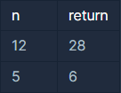

## 약수의 합

---

<p style = "color:#8f7cee; font-size:25px; font-weight:bold">
문제 설명
</p>

정수 n을 입력받아 n의 약수를 모두 더한 값을 리턴하는 함수, solution을 완성해주세요.

---

<p style = "color:#8f7cee; font-size:25px; font-weight:bold">
제한 사항
</p>

- n은 0 이상 3000이하인 정수입니다.

---

<p style = "color:#8f7cee; font-size:25px; font-weight:bold">
입출력 예
</p>



입출력 예 #1
- 12의 약수는 1, 2, 3, 4, 6, 12입니다. 이를 모두 더하면 28입니다.

입출력 예 #2
- 5의 약수는 1, 5입니다. 이를 모두 더하면 6입니다.

---

<p style = "color:#8f7cee; font-size:25px; font-weight:bold">
작성 내용
</p>

```C++
#include <iostream>

using namespace std;

int solution(int n) {
    int answer = 0;
    for(int i=1; i<=n; i++)
    {
        if(n%i ==0)
            answer +=i;
    }
    return answer;
}
```

---

<p style = "color:#ed9ece; font-size:20px; font-weight:bold">
정답 여부 O
</p>

<p style = "color:#ed9ece; font-size:20px; font-weight:bold">
소요 시간 : 10분
</p>
