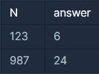

## 자릿수 더하기

<p style = "color:#8f7cee; font-size:25px; font-weight:bold">
문제 설명
</p>
자연수 N이 주어지면, N의 각 자릿수의 합을 구해서 return 하는 solution 함수를 만들어 주세요.
예를들어 N = 123이면 1 + 2 + 3 = 6을 return 하면 됩니다.

<br/>

<p style = "color:#8f7cee; font-size:25px; font-weight:bold">
제한 사항
</p>
N의 범위 : 100,000,000 이하의 자연수

<br/>

<p style = "color:#8f7cee; font-size:25px; font-weight:bold">
입출력 예
</p>



입출력 예 #1
문제의 예시와 같습니다.

입출력 예 #2
9 + 8 + 7 = 24이므로 24를 return 하면 됩니다.

<br/>

<p style = "color:#8f7cee; font-size:25px; font-weight:bold">
작성 내용
</p>

```C++
#include <iostream>

using namespace std;
int solution(int n)
{
    int answer = 0;

    while(n != 0)
    {
        answer+=n%10;
        n/=10;
    }

    return answer;
}
```

<br/>

<p style = "color:#ed9ece; font-size:20px; font-weight:bold">
정답 여부 O
</p>

<p style = "color:#ed9ece; font-size:20px; font-weight:bold">
소요 시간 : 12분
</p>
