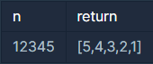

## 자연수 뒤집어 배열로 만들기

---

<p style = "color:#8f7cee; font-size:25px; font-weight:bold">
문제 설명
</p>

자연수 n을 뒤집어 각 자리 숫자를 원소로 가지는 배열 형태로 리턴해주세요. 예를들어 n이 12345이면 [5,4,3,2,1]을 리턴합니다.

---

<p style = "color:#8f7cee; font-size:25px; font-weight:bold">
제한 사항
</p>

- n은 10,000,000,000이하인 자연수입니다.

---

<p style = "color:#8f7cee; font-size:25px; font-weight:bold">
입출력 예
</p>



---

<p style = "color:#8f7cee; font-size:25px; font-weight:bold">
작성 내용
</p>

```C++
#include <iostream>
#include <vector>

using namespace std;

vector<int> solution(long long n) {
    vector<int> answer;
    
    while(n!=0)
    {
        answer.push_back(n%10);
        n/=10;
    }
    
    return answer;
}
```

---

<p style = "color:#ed9ece; font-size:20px; font-weight:bold">
정답 여부 O
</p>

<p style = "color:#ed9ece; font-size:20px; font-weight:bold">
소요 시간 : 12분
</p>
