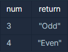

## 짝수와 홀수

<p style = "color:#8f7cee; font-size:25px; font-weight:bold">
문제 설명
</p>

정수 num이 짝수일 경우 "Even"을 반환하고 홀수인 경우 "Odd"를 반환하는 함수, solution을 완성해주세요.

<br/>

<p style = "color:#8f7cee; font-size:25px; font-weight:bold">
제한 사항
</p>

- num은 int 범위의 정수입니다.
- 0은 짝수입니다.

<br/>

<p style = "color:#8f7cee; font-size:25px; font-weight:bold">
입출력 예
</p>



<br/>
<br/>

<p style = "color:#8f7cee; font-size:25px; font-weight:bold">
작성 내용
</p>

```C++
#include <iostream>
#include <string>

using namespace std;

string solution(int num) {
    string answer = "";
    
    if(num%2==0)
        answer.append("Even");
    else
        answer.append("Odd");
        
    return answer;
}
```

<br/>

<p style = "color:#ed9ece; font-size:20px; font-weight:bold">
정답 여부 O
</p>

<p style = "color:#ed9ece; font-size:20px; font-weight:bold">
소요 시간 : 2분 30초
</p>
