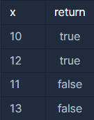

## 하샤드 수

<p style = "color:#8f7cee; font-size:25px; font-weight:bold">
문제 설명
</p>

양의 정수 x가 하샤드 수이려면 x의 자릿수의 합으로 x가 나누어져야 합니다. 예를 들어 18의 자릿수 합은 1+8=9이고, 18은 9로 나누어 떨어지므로 18은 하샤드 수입니다. 자연수 x를 입력받아 x가 하샤드 수인지 아닌지 검사하는 함수, solution을 완성해주세요.

<br/>

<p style = "color:#8f7cee; font-size:25px; font-weight:bold">
제한 사항
</p>

x는 1 이상, 10000 이하인 정수입니다.

<br/>

<p style = "color:#8f7cee; font-size:25px; font-weight:bold">
입출력 예
</p>



입출력 예 #1
10의 모든 자릿수의 합은 1입니다. 10은 1로 나누어 떨어지므로 10은 하샤드 수입니다.

입출력 예 #2
12의 모든 자릿수의 합은 3입니다. 12는 3으로 나누어 떨어지므로 12는 하샤드 수입니다.

입출력 예 #3
11의 모든 자릿수의 합은 2입니다. 11은 2로 나누어 떨어지지 않으므로 11는 하샤드 수가 아닙니다.

입출력 예 #4
13의 모든 자릿수의 합은 4입니다. 13은 4로 나누어 떨어지지 않으므로 13은 하샤드 수가 아닙니다.

<br/>

<p style = "color:#8f7cee; font-size:25px; font-weight:bold">
작성 내용
</p>

```C++
#include <iostream>

using namespace std;

bool solution(int x) {
    bool answer = true;
    
    int num = x;
    int sum = 0;
    while(num != 0)
    {
        sum += num%10;
        num/=10;     
    }
    
    if(x % sum != 0)
        answer = false;
    
    return answer;
}
```

<br/>

<p style = "color:#ed9ece; font-size:20px; font-weight:bold">
정답 여부 O
</p>

<p style = "color:#ed9ece; font-size:20px; font-weight:bold">
소요 시간 : 4분
</p>

