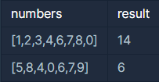

## 없는 숫자 더하기

---

<p style = "color:#8f7cee; font-size:25px; font-weight:bold">
문제 설명
</p>

0부터 9까지의 숫자 중 일부가 들어있는 정수 배열 numbers가 매개변수로 주어집니다. numbers에서 찾을 수 없는 0부터 9까지의 숫자를 모두 찾아 더한 수를 return 하도록 solution 함수를 완성해주세요.

---

<p style = "color:#8f7cee; font-size:25px; font-weight:bold">
제한 사항
</p>

- 1 ≤ numbers의 길이 ≤ 9
  - 0 ≤ numbers의 모든 원소 ≤ 9
  - numbers의 모든 원소는 서로 다릅니다.

---

<p style = "color:#8f7cee; font-size:25px; font-weight:bold">
입출력 예
</p>



입출력 예 #1
  - 5, 9가 numbers에 없으므로, 5 + 9 = 14를 return 해야 합니다.

입출력 예 #2
  - 1, 2, 3이 numbers에 없으므로, 1 + 2 + 3 = 6을 return 해야 합니다.

---

<p style = "color:#8f7cee; font-size:25px; font-weight:bold">
작성 내용
</p>

```C++
#include <iostream>
#include <vector>

using namespace std;

int solution(vector<int> numbers) {
    int answer = 0;
    
    vector<int> count(10, 0);
    
    for(int i=0; i<numbers.size(); i++)
    {
        count[numbers[i]]++;
    }
    
    for(int i=0; i<count.size(); i++)
    {
        if(count[i] == 0)
            answer += i;
    }
    
    
    return answer;
}
```

---

<p style = "color:#ed9ece; font-size:20px; font-weight:bold">
정답 여부 O
</p>

<p style = "color:#ed9ece; font-size:20px; font-weight:bold">
소요 시간 : 5분 30초
</p>

