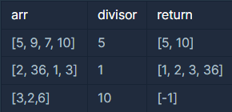

## 나누어 떨어지는 숫자 배열

---

<p style = "color:#8f7cee; font-size:25px; font-weight:bold">
문제 설명
</p>

array의 각 element 중 divisor로 나누어 떨어지는 값을 오름차순으로 정렬한 배열을 반환하는 함수, solution을 작성해주세요.
divisor로 나누어 떨어지는 element가 하나도 없다면 배열에 -1을 담아 반환하세요.

---

<p style = "color:#8f7cee; font-size:25px; font-weight:bold">
제한 사항
</p>

- arr은 자연수를 담은 배열입니다.
- 정수 i, j에 대해 i ≠ j 이면 arr[i] ≠ arr[j] 입니다.
- divisor는 자연수입니다.
- array는 길이 1 이상인 배열입니다.

---

<p style = "color:#8f7cee; font-size:25px; font-weight:bold">
입출력 예
</p>



입출력 예#1
 - arr의 원소 중 5로 나누어 떨어지는 원소는 5와 10입니다. 따라서 [5, 10]을 리턴합니다.

입출력 예#2
 - arr의 모든 원소는 1으로 나누어 떨어집니다. 원소를 오름차순으로 정렬해 [1, 2, 3, 36]을 리턴합니다.

입출력 예#3
- 3, 2, 6은 10으로 나누어 떨어지지 않습니다. 나누어 떨어지는 원소가 없으므로 [-1]을 리턴합니다.

---

<p style = "color:#8f7cee; font-size:25px; font-weight:bold">
작성 내용
</p>

```C++
#include <iostream>
#include <vector>
#include <algorithm>

using namespace std;

vector<int> solution(vector<int> arr, int divisor) {
    vector<int> answer;
    
    for(int i=0; i<arr.size(); i++)
    {
        if(arr[i] % divisor == 0)
            answer.push_back(arr[i]);
    }
    
    if(answer.size() == 0)
        answer.push_back(-1);
    
    sort(answer.begin(), answer.end());
    
    return answer;
}
```

---

<p style = "color:#ed9ece; font-size:20px; font-weight:bold">
정답 여부 O
</p>

<p style = "color:#ed9ece; font-size:20px; font-weight:bold">
소요 시간 : 3분 30초
</p>

