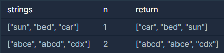

## 문자열 내 마음대로 정렬하기

---

<p style = "color:#8f7cee; font-size:25px; font-weight:bold">
문제 설명
</p>

문자열로 구성된 리스트 strings와, 정수 n이 주어졌을 때, 각 문자열의 인덱스 n번째 글자를 기준으로 오름차순 정렬하려 합니다. 예를 들어 strings가 ["sun", "bed", "car"]이고 n이 1이면 각 단어의 인덱스 1의 문자 "u", "e", "a"로 strings를 정렬합니다.

---

<p style = "color:#8f7cee; font-size:25px; font-weight:bold">
제한 사항
</p>

- strings는 길이 1 이상, 50이하인 배열입니다.
- strings의 원소는 소문자 알파벳으로 이루어져 있습니다.
- strings의 원소는 길이 1 이상, 100이하인 문자열입니다.
- 모든 strings의 원소의 길이는 n보다 큽니다.
- 인덱스 1의 문자가 같은 문자열이 여럿 일 경우, 사전순으로 앞선 문자열이 앞쪽에 위치합니다.

---

<p style = "color:#8f7cee; font-size:25px; font-weight:bold">
입출력 예
</p>



입출력 예 1
- "sun", "bed", "car"의 1번째 인덱스 값은 각각 "u", "e", "a" 입니다. 이를 기준으로 strings를 정렬하면 ["car", "bed", "sun"] 입니다.

입출력 예 2
- "abce"와 "abcd", "cdx"의 2번째 인덱스 값은 "c", "c", "x"입니다. 따라서 정렬 후에는 "cdx"가 가장 뒤에 위치합니다. "abce"와 "abcd"는 사전순으로 정렬하면 "abcd"가 우선하므로, 답은 ["abcd", "abce", "cdx"] 입니다.

---

<p style = "color:#8f7cee; font-size:25px; font-weight:bold">
작성 내용
</p>

```C++
#include <iostream>
#include <string>
#include <vector>
#include <algorithm>

using namespace std;

vector<string> solution(vector<string> strings, int n) {
    vector<string> answer;
    
    for(int i=0; i<strings.size(); i++)
    {
        for(int j=i; j<strings.size(); j++)
        {
            if(strings[j][n] < strings[i][n])
            {
                string temp = strings[j];
                strings[j] = strings[i];
                strings[i] = temp;
            }
            else if(strings[i][n] == strings[j][n])
            {
                vector<string> str;
                str.push_back(strings[j]);
                str.push_back(strings[i]);
                
                sort(str.begin(), str.end());
                
                strings[i] = str[0];
                strings[j] = str[1];
            }
        }
    }
    
    answer = strings;
    
    return answer;
}
```

---

<p style = "color:#ed9ece; font-size:20px; font-weight:bold">
정답 여부 O
</p>

<p style = "color:#ed9ece; font-size:20px; font-weight:bold">
소요 시간 : 30분
</p>
