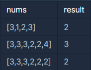

## 폰켓몬

---

<p style = "color:#8f7cee; font-size:25px; font-weight:bold">
문제 설명
</p>

당신은 폰켓몬을 잡기 위한 오랜 여행 끝에, 홍 박사님의 연구실에 도착했습니다. 홍 박사님은 당신에게 자신의 연구실에 있는 총 N 마리의 폰켓몬 중에서 N/2마리를 가져가도 좋다고 했습니다.
홍 박사님 연구실의 폰켓몬은 종류에 따라 번호를 붙여 구분합니다. 따라서 같은 종류의 폰켓몬은 같은 번호를 가지고 있습니다. 예를 들어 연구실에 총 4마리의 폰켓몬이 있고, 각 폰켓몬의 종류 번호가 [3번, 1번, 2번, 3번]이라면 이는 3번 폰켓몬 두 마리, 1번 폰켓몬 한 마리, 2번 폰켓몬 한 마리가 있음을 나타냅니다. 이때, 4마리의 폰켓몬 중 2마리를 고르는 방법은 다음과 같이 6가지가 있습니다.

1. 첫 번째(3번), 두 번째(1번) 폰켓몬을 선택
2. 첫 번째(3번), 세 번째(2번) 폰켓몬을 선택
3. 첫 번째(3번), 네 번째(3번) 폰켓몬을 선택
4. 두 번째(1번), 세 번째(2번) 폰켓몬을 선택
5. 두 번째(1번), 네 번째(3번) 폰켓몬을 선택
6. 세 번째(2번), 네 번째(3번) 폰켓몬을 선택

이때, 첫 번째(3번) 폰켓몬과 네 번째(3번) 폰켓몬을 선택하는 방법은 한 종류(3번 폰켓몬 두 마리)의 폰켓몬만 가질 수 있지만, 다른 방법들은 모두 두 종류의 폰켓몬을 가질 수 있습니다. 따라서 위 예시에서 가질 수 있는 폰켓몬 종류 수의 최댓값은 2가 됩니다.
당신은 최대한 다양한 종류의 폰켓몬을 가지길 원하기 때문에, 최대한 많은 종류의 폰켓몬을 포함해서 N/2마리를 선택하려 합니다. N마리 폰켓몬의 종류 번호가 담긴 배열 nums가 매개변수로 주어질 때, N/2마리의 폰켓몬을 선택하는 방법 중, 가장 많은 종류의 폰켓몬을 선택하는 방법을 찾아, 그때의 폰켓몬 종류 번호의 개수를 return 하도록 solution 함수를 완성해주세요.

---

<p style = "color:#8f7cee; font-size:25px; font-weight:bold">
제한 사항
</p>

- nums는 폰켓몬의 종류 번호가 담긴 1차원 배열입니다.
- nums의 길이(N)는 1 이상 10,000 이하의 자연수이며, 항상 짝수로 주어집니다.
- 폰켓몬의 종류 번호는 1 이상 200,000 이하의 자연수로 나타냅니다.
- 가장 많은 종류의 폰켓몬을 선택하는 방법이 여러 가지인 경우에도, 선택할 수 있는 폰켓몬 종류 개수의 최댓값 하나만 return 하면 됩니다.

---

<p style = "color:#8f7cee; font-size:25px; font-weight:bold">
입출력 예
</p>



입출력 예 #1
- 문제의 예시와 같습니다.

입출력 예 #2
- 6마리의 폰켓몬이 있으므로, 3마리의 폰켓몬을 골라야 합니다.
가장 많은 종류의 폰켓몬을 고르기 위해서는 3번 폰켓몬 한 마리, 2번 폰켓몬 한 마리, 4번 폰켓몬 한 마리를 고르면 되며, 따라서 3을 return 합니다.

입출력 예 #3
- 6마리의 폰켓몬이 있으므로, 3마리의 폰켓몬을 골라야 합니다.
가장 많은 종류의 폰켓몬을 고르기 위해서는 3번 폰켓몬 한 마리와 2번 폰켓몬 두 마리를 고르거나, 혹은 3번 폰켓몬 두 마리와 2번 폰켓몬 한 마리를 고르면 됩니다. 따라서 최대 고를 수 있는 폰켓몬 종류의 수는 2입니다.

---

<p style = "color:#8f7cee; font-size:25px; font-weight:bold">
작성 내용
</p>

```C++
#include <iostream>
#include <vector>
#include <algorithm>

using namespace std;

int solution(vector<int> nums)
{
    int answer = 0;

    int num = nums.size() / 2;
    sort(nums.begin(), nums.end());
    
    nums.erase(unique(nums.begin(), nums.end()), nums.end());
    
    if(nums.size() > num)
        answer = num;
    else
        answer = nums.size();
    
    return answer;
}
```

---

<p style = "color:#ed9ece; font-size:20px; font-weight:bold">
정답 여부 X 
</p>

<p style = "color:#ed9ece; font-size:20px; font-weight:bold">
소요 시간 : 28분 30초 
</p>

<p style = "color:#ed9ece; font-size:20px; font-weight:bold">
문제 소감
</p>

- 배열에서 중복을 제거하기 위해서는 정렬을 하고 삭제해야 한다.
- 중복 삭제는 배열.erase(unique(배열.begin(), 배열.end()), 배열.end()); 이다.