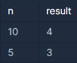

## 소수 찾기

---

<p style = "color:#8f7cee; font-size:25px; font-weight:bold">
문제 설명
</p>

1부터 입력받은 숫자 n 사이에 있는 소수의 개수를 반환하는 함수, solution을 만들어 보세요.

소수는 1과 자기 자신으로만 나누어지는 수를 의미합니다.
(1은 소수가 아닙니다.)

---

<p style = "color:#8f7cee; font-size:25px; font-weight:bold">
제한 사항
</p>

- n은 2이상 1000000이하의 자연수입니다.

---

<p style = "color:#8f7cee; font-size:25px; font-weight:bold">
입출력 예
</p>



입출력 예 #1
- 1부터 10 사이의 소수는 [2,3,5,7] 4개가 존재하므로 4를 반환

입출력 예 #2
- 1부터 5 사이의 소수는 [2,3,5] 3개가 존재하므로 3를 반환

---

<p style = "color:#8f7cee; font-size:25px; font-weight:bold">
작성 내용
</p>

```C++
#include <iostream>
#include <vector>

using namespace std;

int solution(int n) {
    int answer = 0;
    
    vector<bool> Count(n+1, true);
    Count[0] = false;
    Count[1] = false;
    
    for(int i=2; i*i<=n; i++)
    {
        if(Count[i] == true)
        {
            for(int j=i*i; j<=n; j+=i)
            {
                Count[j] = false;
            }
        }
    }
    
    for(int i=0; i<=n; i++)
    {
        if(Count[i] == true)
            answer++;
    }
    
    return answer;
}
```

---

<p style = "color:#ed9ece; font-size:20px; font-weight:bold">
정답 여부 X
</p>

<p style = "color:#ed9ece; font-size:20px; font-weight:bold">
소요 시간 : 15분  
</p>

<p style = "color:#ed9ece; font-size:20px; font-weight:bold">
문제 소감
</p>

- 해당 문제를 풀면서 소수를 찾는 거도 방법이지만, 효율성을 높이기 위해서는 소수가 아닌 것을 제외하는 방법이 빠르다는 것을 알았다.
- 배제를 하기 위해서 어떤 숫자가 해당 조건에 성립되지 않는지 빨리 파악할 필요가 있다고 생각했다.
- 해당 코드는 에레 스토 테네스의 체를 이용하여 작성하였다.