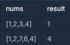

## 소수 찾기

---

<p style = "color:#8f7cee; font-size:25px; font-weight:bold">
문제 설명
</p>

주어진 숫자 중 3개의 수를 더했을 때 소수가 되는 경우의 개수를 구하려고 합니다. 숫자들이 들어있는 배열 nums가 매개변수로 주어질 때, nums에 있는 숫자들 중 서로 다른 3개를 골라 더했을 때 소수가 되는 경우의 개수를 return 하도록 solution 함수를 완성해주세요.

---

<p style = "color:#8f7cee; font-size:25px; font-weight:bold">
제한 사항
</p>

- nums에 들어있는 숫자의 개수는 3개 이상 50개 이하입니다.
- nums의 각 원소는 1 이상 1,000 이하의 자연수이며, 중복된 숫자가 들어있지 않습니다.

---

<p style = "color:#8f7cee; font-size:25px; font-weight:bold">
입출력 예
</p>



입출력 예 #1
- [1,2,4]를 이용해서 7을 만들 수 있습니다.

입출력 예 #2
- [1,2,4]를 이용해서 7을 만들 수 있습니다.
- [1,4,6]을 이용해서 11을 만들 수 있습니다.
- [2,4,7]을 이용해서 13을 만들 수 있습니다.
- [4,6,7]을 이용해서 17을 만들 수 있습니다.

---

<p style = "color:#8f7cee; font-size:25px; font-weight:bold">
작성 내용
</p>

```C++
#include <iostream>
#include <vector>

using namespace std;

int solution(vector<int> nums) {
    int answer = 0;

    vector<int> number;
    
    for(int i=0; i<nums.size()-2; i++)
    {
        for(int j=i+1; j<nums.size()-1; j++)
        {
            for(int l=j+1; l<nums.size(); l++)
            {
                int sum = nums[i] + nums[j] + nums[l];
                number.push_back(sum);
            }
        }
    }
    
    for(int i=0; i<number.size(); i++)
    {
        bool check = false;
        for(int l=2; l*l<=number[i]; l++)
        {
            if(number[i] % l == 0)
            {
                check = true;   
                break;
            }
        }
        if(check == false)
            answer++;
    }

    return answer;
}
```

---

<p style = "color:#ed9ece; font-size:20px; font-weight:bold">
정답 여부 O
</p>

<p style = "color:#ed9ece; font-size:20px; font-weight:bold">
소요 시간 : 21분  
</p>

