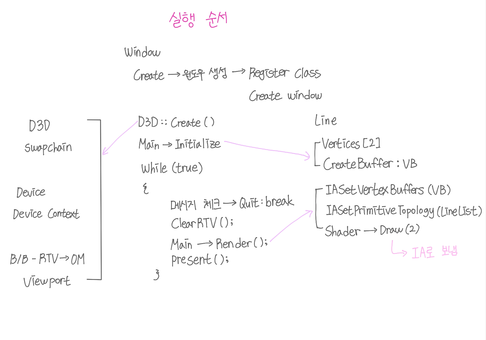
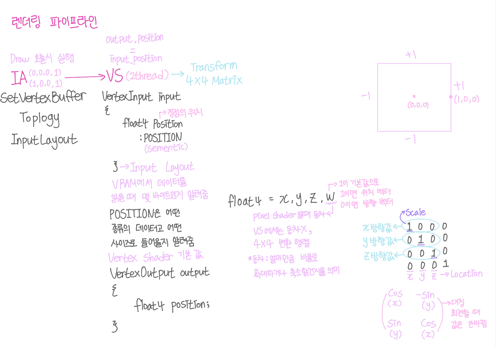

## Direct X - 2

<p style = "color:#8f7cee; font-size:25px; font-weight:bold">
SwapChain
</p>

---

SwapChain : Device와 Device Context를 하나의 그룹을 묶어 관활, 하드웨어 계층
Device : CPU 관활
Device Context : 실제로 렌더링 파이프 라인을 탄 이후 GPU영역


D3D.cpp
```cpp
void D3D::ClearRenderTargetView(Color InColor)
{
	DeviceContext->ClearRenderTargetView(RenderTargetView, InColor);
} //어떤 색으로 지울지 정해줌

void D3D::Present()
{
	SwapChain->Present(0, 0);
} //Rendering한걸 BackBuffer에 보내고 BackBuffer 두 개가 번갈아가며 보여줌, OM -> B/B
```

<p style = "color:#8f7cee; font-size:25px; font-weight:bold">
RTV
</p>

---

RTV 안에는 텍스처(화면에 보이는는 픽셀)가 있고 RAM에서 처리한다.
RTV는 픽셀이 모여있는 곳으로 더블 버퍼에서 실제 보이이는 창인 메인 버퍼의 주소를 받아와 연결시켜준다. Main Buffer을 받아오고 Device->CreateRenderTargetView와 DeviceContext->OMSetRenderTargets를 호출하여 OM에 값을 설정하고 B/B로 보낸다.

<br/>

<p style = "color:#8f7cee; font-size:25px; font-weight:bold">
Viewport
</p>

---

Viewport는 B/B의 영역을 지정해 준 것이고 RS에 세팅해 준다. 타이틀 화면을 제외한 영역을 B/B라고 한다. Viewport는 BB에 얼마만큼 렌더링 할지를 정해주는 것이다.

<br/>

<p style = "color:#8f7cee; font-size:25px; font-weight:bold">
VS
</p>

---

VS는 스레드가 정점의 개수만큼 열리고 스레드마다 VS 함수를 실행한다.

<p style = "color:#8f7cee; font-size:25px; font-weight:bold">
RS
</p>

---

RS는 정점에서 정점까지 픽셀을 다 채운다

<p style = "color:#8f7cee; font-size:25px; font-weight:bold">
PS
</p>

---

PS는 픽셀의 개수만큼 스레드를 만든다.

04_Line.fx
```cpp
struct VertexInput
{
    float4 Position : POSITION;
}; //Shader에서 POSITION을 찾음

struct VertexOutput
{
    float4 Position : SV_Position;
};

VertexOutput VS(VertexInput input)
{
    VertexOutput output;
    output.Position = input.Position;
    
    return output;
} //정점의 개수만큼 스레드가 열림, 스레드 마다 VS 함수를 실행, RS로 리턴해줌

float4 PS(VertexOutput input) : SV_Target
{
    return float4(1, 0, 0, 1); //RGBA
} //VS가 리턴한 것을 RS를 거쳐 들어옴

technique11 T0
{
    pass P0
    {
        SetVertexShader(CompileShader(vs_5_0, VS())); //VS함수를 vs_5_0으로 호출하여 SetVertexShader한다
        SetPixelShader(CompileShader(ps_5_0, PS()));
    }
}
```

Line.cpp
```cpp
void Line::Initialize()
{
	shader = new Shader(L"04_Line.fx");

	Vertices[0] = Vector(0.0f, 0.0f, 0.0f); //DirectX에서 좌표는 수학 좌표를 따름
	Vertices[1] = Vector(1.0f, 0.0f, 0.0f);

	D3D11_BUFFER_DESC desc;
	ZeroMemory(&desc, sizeof(D3D11_BUFFER_DESC));
	desc.ByteWidth = sizeof(Vector) * 2; //버퍼의 공간
	desc.BindFlags = D3D11_BIND_VERTEX_BUFFER; //vertex 버퍼에 연결

	D3D11_SUBRESOURCE_DATA subResource; //복사될 데이터
	ZeroMemory(&subResource, sizeof(D3D11_SUBRESOURCE_DATA));
	subResource.pSysMem = Vertices; //시작 주소에서 사이즈 만큼 복사하여 GPU에 넣음

	D3D::Get()->GetDevice()->CreateBuffer(&desc, &subResource, &VertexBuffer);
}
```

shader->Draw에서 IA를 세팅하고 VS(.fx) 파일의 VS 함수에서 처리한다.
```cpp
void Line::Render()
{
	UINT stride = sizeof(Vector);
	UINT offset = 0;

	D3D::Get()->GetDeviceContext()->IASetVertexBuffers(0, 1, &VertexBuffer, &stride, &offset); //그릴 데이터를 IA에 세팅
	D3D::Get()->GetDeviceContext()->IASetPrimitiveTopology(D3D11_PRIMITIVE_TOPOLOGY_LINELIST); //어떤식으로 그릴지 정해줌

	shader->Draw(0, 0, 2);
}
```

<br/>

<p style = "color:#8f7cee; font-size:25px; font-weight:bold">
Main
</p>

---

Main은 IExecutable을 상속 받고 IExecutable형의 벡터를 넣어줄 공간인 executes와 넣어주는 함수인 Push를 만든다. 

Main.cpp
```cpp
void Main::Initialize()
{
	Push(new Line()); //Line을 새로 생성해 Push한다.
}

void Main::Destroy()
{
	for (IExecutable* execute : executes) //executes에 있는 내용을 for문으로 받아 삭제한다.
	{
		execute->Destroy();

		Delete(execute);
	}
}

void Main::Tick()
{
	for (IExecutable* execute : executes)
		execute->Tick();
}

void Main::Render()
{
	for (IExecutable* execute : executes)
		execute->Render();
}

void Main::Push(IExecutable* execute)
{
	executes.push_back(execute); //excute를 excutes에 삽입한다.

	execute->Initialize(); //Initialize 호출
}
```

<br/>

<p style = "color:#8f7cee; font-size:25px; font-weight:bold">
실행 순서
</p>

---





