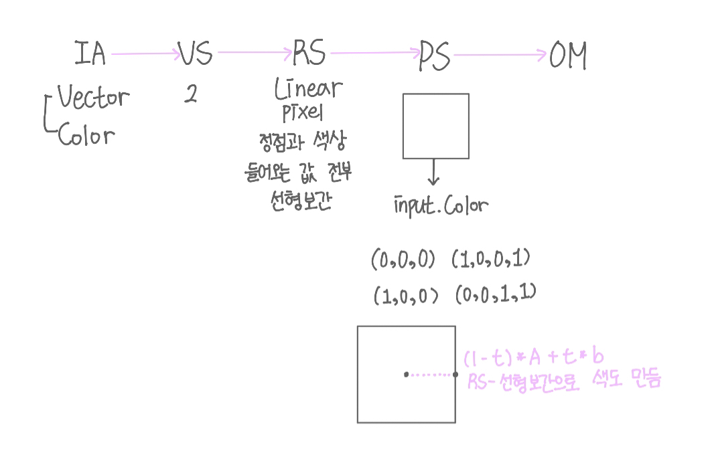
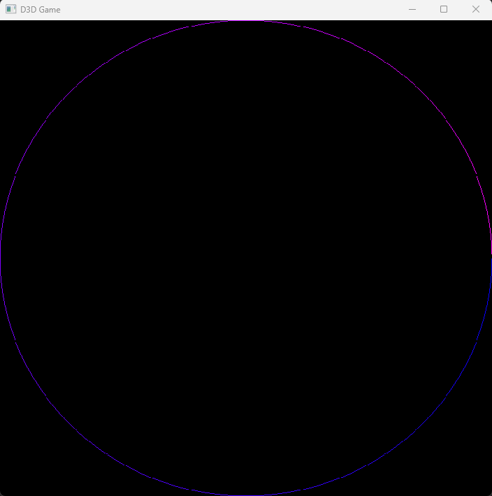
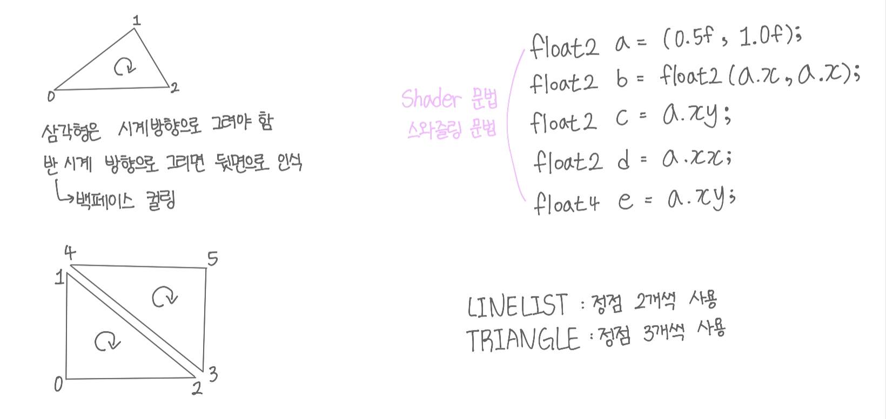
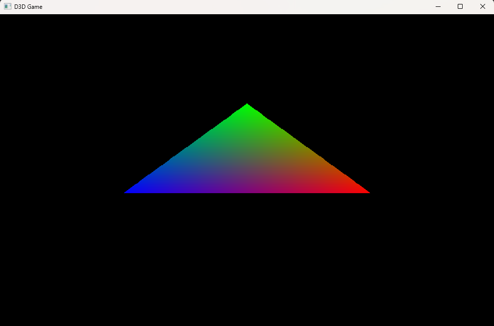
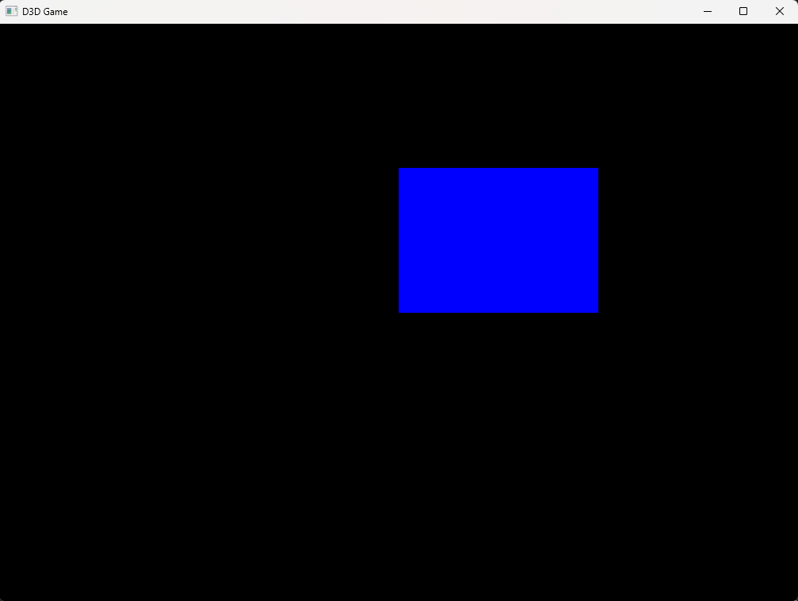

## Direct X - 3

<p style = "color:#8f7cee; font-size:25px; font-weight:bold">
Topology
</p>

---

Topology에 따라 사용해야 하는 정점의 개수와 그려지는 모양이 다르다.

D3D11_PRIMITIVE_TOPOLOGY_LINELIST : 이는 정점 두 개씩 짝을 이뤄 선을 그어주고 짝수 개의 정점이 필요하다.

D3D11_PRIMITIVE_TOPOLOGY_LINESTRIP : 서로 연결된 Line을 그리기 위해 사용하고 정점은 2개 이상 필요하고 여러 개의 선들이 이어져 하나의 스트립으로 보인다.

<br/>

<p style = "color:#8f7cee; font-size:25px; font-weight:bold">
Circle 그리기
</p>

---

360개의 Vector에 반지름으로 계산한 cos과 sin 값 대입하여 정점을 만들고 해당 점들을 D3D11_PRIMITIVE_TOPOLOGY_LINESTRIP을 이용하여 이어준다.

```cpp
for (int i = 0; i < 360; i++)
{
	float radian = Math::ToRadian(float(i));

	float x = cosf(radian);
	float y = -sinf(radian);
		
	printf("%d : %f, %f, %f\n", i, radian, x, y);

	Vertices.push_back(VertexColor(Vector(x, y, 0.0f), Color((float)i / 360.0f, 0, 1, 1)));
}
```

<br/>

RS 구간에서 선형 보간으로 색을 만들고 이를 PS에 넘겨준다. RS 구간에 들어오는 모든 값은 선형 보간으로 처리한다.



<br/>



<br/>

<p style = "color:#8f7cee; font-size:25px; font-weight:bold">
Triangle 그리기
</p>

---

3개의 정점을 받아와 D3D11_PRIMITIVE_TOPOLOGY_TRIANGLELIST을 이용하여 그려준다. D3D11_PRIMITIVE_TOPOLOGY_TRIANGLELIST은 3개의 점을 이어 삼각형을 만드는 Topology이다.

삼각형은 시계 방향으로 그려야만 출력이 된다. 반 시계 방향으로 그리면 뒷면으로 인식한다. 이를 백페이스 컬링이라고 한다.



<br/>



<br/>

<p style = "color:#8f7cee; font-size:25px; font-weight:bold">
Rectangle 그리기
</p>

---

Rectangle을 그리는 방법에는 두 가지 방법이 있다. 첫 번째는 삼각형 두 개를 그려 사각형을 만드는 것이고 두 번째는 사각형 하나를 그리는 것이다.

첫 번째 방법은 삼각형 2개 총 정점 6개를 TRIANGLELIST를 이용하여 그린다.

두 번째 방법은 정점 4개를 이용하여 TRIANGLESTRIP를 이용하여 그린다. 

<br/>



