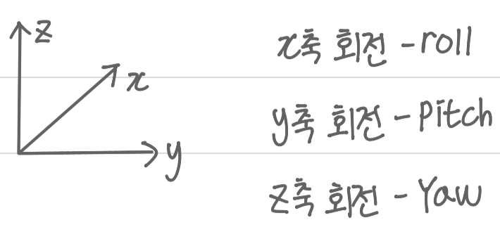
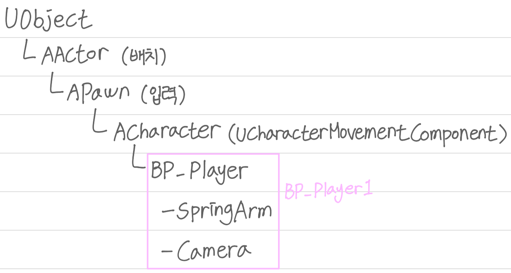
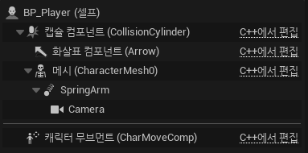
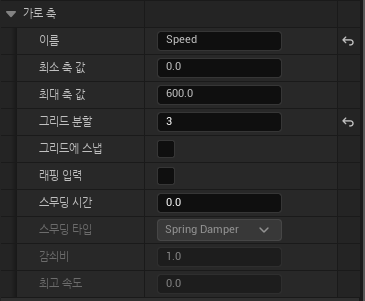
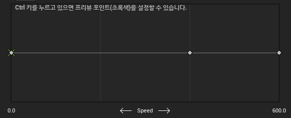
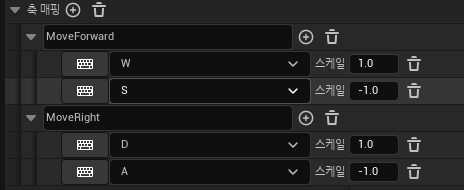

## Unreal Engine (BluePrint - 1)

회전

---

 

UObject

---

 

 

BluePrint

---

BluePrint는 Unreal C++을 사용하지 않고도 프로그래밍을 할 수 있는 환경으로 BluePrint로 이미 만들어진 Component를 EventGraph에서 사용이 가능하다.

 

SpringArm

---

SpringArm은 플레이어와 일정 거리를 유지시켜주는 Component로 주로 플레이어 뒤에 Camera를 달아줄 때 사용한다.

플레이어의 메시에 추가 버튼을 눌러 SpringArm 컴포넌트를 추가해 준 뒤 SpringArm 아래에 카메라를 추가해 준다.

 

SpringArm을 생성하면 플레이어의 발 부분인 0지점에 생성되기 때문에 방향과 위치를 조정하여 플레이어의 뒤로 이동시켜준다. SpringArm을 플레이어 뒤로 이동시켜주면 SpringArm의 아래에 있는 카메라도 같이 움직여 플레이어의 뒤에서 플레이어를 비추게 된다. 플레이어와 SpringArm의 거리를 조정할 때는 X의 값을 늘려주는 것이 아닌 타겟 암 거리를 이용하여 조정해 준다. 

 

폰의 플레이어 자동 빙의를 설정하면 게임이 시작하자마자 플레이어의 카메라가 메인 카메라가 된다.

게임에서 카메라는 플레이어의 바로 뒤를 비추는 것이 아닌 카메라의 중심에서 약간 왼쪽에 플레이어가 있도록 설정해 주어야 한다.

카메라의 필름 맥을 Full Frame DSLR으로 설정해 준다.

 

BlendSpace 1D

---

애니메이션을 섞어주는 기능으로 최대 축 값과 그리드를 설정해 줄 수 있다.

 

Shift를 누르고 원하는 지점에 애니메이션을 삽입하여 애니메이션을 섞어 줄 수 있다.

 

 

Animation BluePrint

---

Animation BluePrint는 Animation을 BluePrint의 EvnetGraph를 만드는 환경으로 어떤 상황에서 해당 애니메이션을 사용할지 만들 수 있다.

매핑

---

액션 매핑은 한번 누를 때 사용하는 것으로 주로 점프나 총을 발사할 때 사용한다. 축 매핑은 키를 지속적으로 누를 때 사용하는 것으로 스케일에 값을 줄 수 있다.

 

 

 