## Unreal Engine (BluePrint - 2)

회전

---

정면을 기준으로 0 오른쪽으로 90도 회전하면 90, 왼쪽으로 90도 회전하면 -90, 뒤로 회전하면 -180 혹은 180이라고 한다.

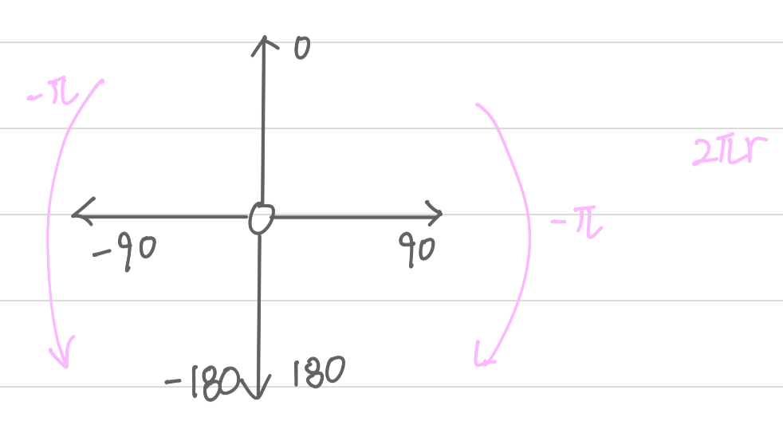

 

마우스 회전

---

플레이어가 마우스를 움직이는 방향으로 화면을 전환을 구현하기 위해서 축 매핑에 HorizontalLook을 생성하고 마우스의 X 값, VerticalLook을 생성하고 마우스의 Y 값을 준다.

HorizontalLook은 Yaw 회전을 시키고 VerticalLook은 Pitch 회전을 시킨다.

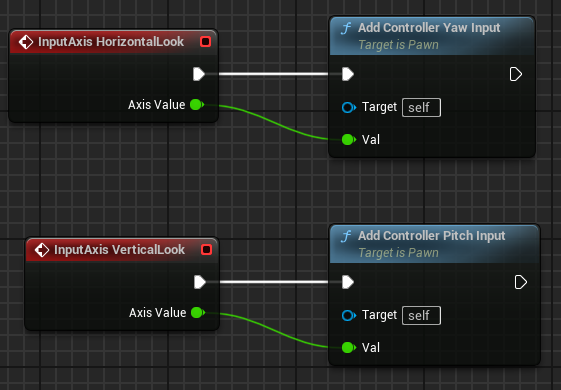 

SpringArm의 카메라 세팅에서 폰 제어 회전 사용을 False 처리하여야 Yaw 회전을 한다.

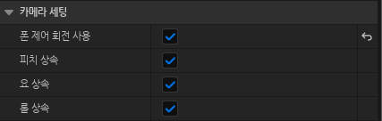 

카메라의 Yaw 회전이 World 좌표를 기준으로 움직이기 때문에 Local 좌표를 기준으로 움직이게 하기 위하여 Control Rotation의 Yaw 값의 전방 벡터와 오른쪽 벡터를 받아와 World Direction에 더한다.

 

State Machine (FSM)

---

State Machine은 유한 상태 기계로 애니메이션의 회로를 설정해 주는 것을 말한다. State Machine 안에서 Animation을 바꿔줄 때 원하는 조건을 주어 Animation을 이동시켜준다.

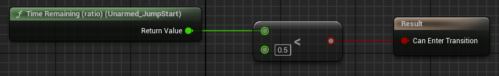 

 

Socket

---

Socket은 플레이어에 다른 물체를 붙여주기 위한 공간으로 원하는 bone 아래에 Socket을 생성하고 위치, 회전, 스케일의 값을 지정해 준다.

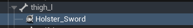 

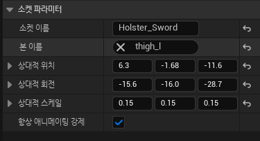 

 

Attach Actor To Component

---

Attach Actor To Component는 Target과 Parent를 설정하여 Parent의 원하는 Socket에 Target을 붙일 수 있다.
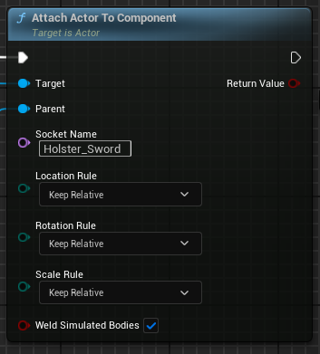 

 

AnimNotify

---

AnimNotify는 Animation이 실행될 때 원하는 지점에서 이벤트를 발생시켜주는 것을 말하고 GetNotifyName, Received_Notify, GetDefaultTriggerWeightThreshold를 오버라이드 할 수 있다.

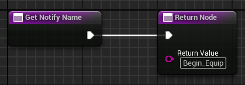 

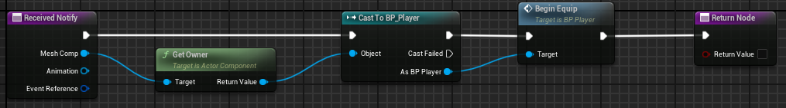 

Animation에서 원하는 지점에 Notify를 지정해 주면 사용이 가능하다.

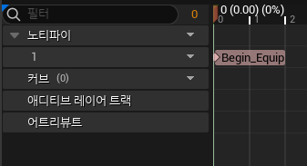 

 

BlendSpace2D

---

BlendSpace2D는 BlendSpace1D랑 비슷하지만 가로축과 세로축을 지정하여 사용한다는 점에서 다르다. 예를 들어 Unarmed 모드에서 4방향으로 걷고 달리는 Animation을 다르게 사용하고 싶을 때 사용할 수 있다.

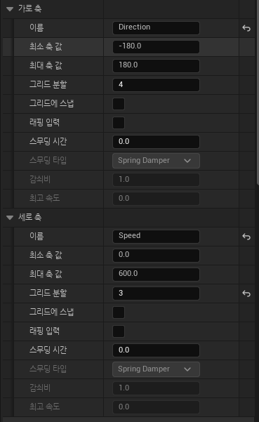 

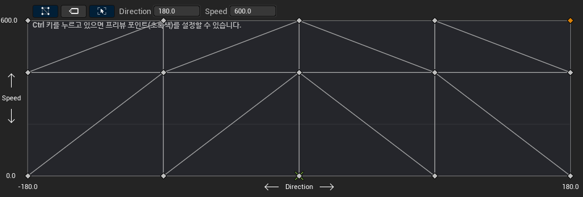 

 
