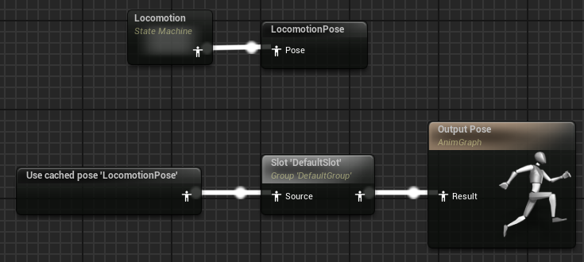
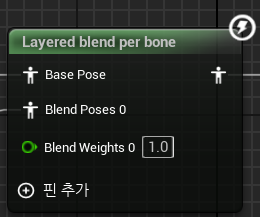
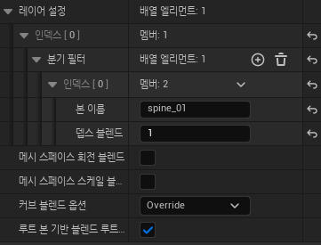
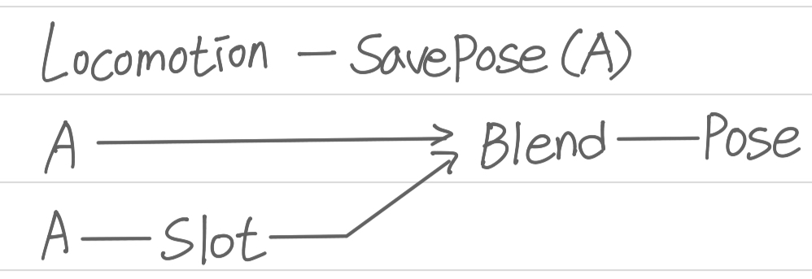
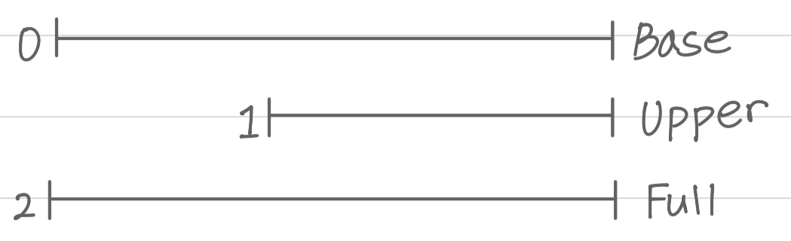
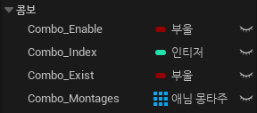
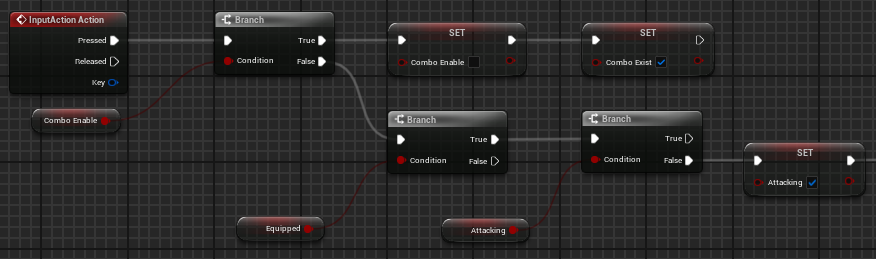
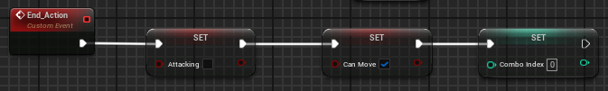
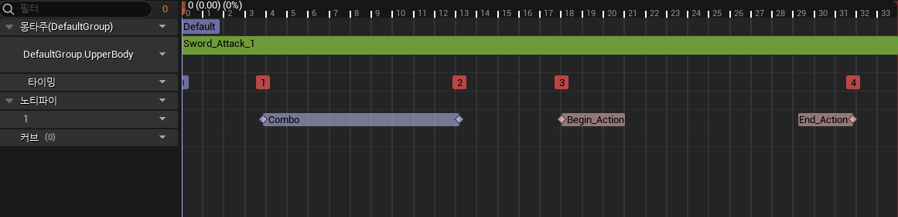

## Unreal Engine (BluePrint - 3)

Calculate Direction

---

Calculate Direction은 바라보는 방향과 움직이는 방향 사이의 각도를 반환하는 것을 말하고 반환되는 값의 범위는 -180에서 180으로 BlendSpace의 방향 값으로 사용이 가능하다. 플레이어가 회전할 때 플레이어가 회전한 각도를 구할 수 있다.

 

AnimNotifyState

---

AnimNotifyState는 Animation의 특정 지점에서 이벤트를 사용하기 위한 것이다. AnimNotiftState를 Montage나 Animation에 지정하면 이벤트를 발생시킬 수 있는 범위가 나온다. 

AnimNotifyState는 GetNotifyName, Received_NotifyBegin, Received_NotifyEnd, GetDefaultTriggerWeightThreshold, Received_NotifyTick을 오버라이드 할 수 있다.

 

AnimMontage

---

AnimMontage는 Animation Instance를 이용하여 만든다. Animation Instance와 AnimMontage의 차이점으로는 Animation Instance는 반복되는 Animation을 사용할 때 주로 쓰고 AnimMontage는 한 번 동작하는 Animation이 필요할 때 주로 이용한다.

 

 

DefaultSlot

---

DefaultSlot은 Montage를 생성하면 기본적으로 들어가 있는 Slot이다. Locomotion에서 Montage를 플레이할 때 Default Slot을 이용하여 State Machine과 이어주는 역할을 한다. 

 

 

Cache Pose

---

State Machine에서 DefaultSlot을 지나 Output Pose로 이동을 하면 DefaultSlot이 한번 실행되면 State Machine에서 오류가 발생한다. 예를 들어 플레이어가 움직이고 칼을 장착하는 부분을 Locomotion에 만들고 Attack 하는 Default Slot을 만들었을 때 공격을 한번 하고 칼을 들고 있는 모습이 아닌 Unarmed 상태로 돌아간다.

이러한 오류가 생기는 이유는 DefalutSlot이 실행되면 Locomotion에서 DefaultSlot으로 넘어가는 부분이 멈추고 DefalutSlot에서 AnimGraph로 이동만이 남기 때문이다. Entry에서 Unarmed, Sword로 이동하고 다시 돌아갈 부분이 없어 Entry가 실행되어 오류가 발생한다.

이를 해결하기 위하여 SavePose를 이용하여 Locomotion의 값을 저장해야 한다.

Cache Pose를 이용하면 저장한 값을 가져올 수 있다.
 

 

Layered Blend per Bone

---

Layered Blend per Bone은 Animation 여러 개를 원하는 지점을 기준으로 섞고 싶을 때 사용한다. Base Pose에 Blend Pose를 섞어줄 때 본 이름과 뎁스 블렌드를 설정할 수 있다. 본 이름을 설정해 주면 해당 본 부터 그 하위에 있는 부분이 뎁스 블렌드(블렌드의 깊이) 만큼 섞인다고 보면 된다. 뎁스 블렌드가 1이면 Blend Pose가 1만큼 Base Pose가 0만큼 섞인다. 

 

 

Action을 실행할 때 Locomotion과 DefaultSlot의 상체를 섞어주기 위하여 Layerd blend per bone을 생성하여 기준이 되는 Locomotion Pose와 Locomotion Pose에서 DefaultSlot로 흘러가는 Pose를 섞어준다. 

 

DefaultSlot을 다른 이름의 Slot으로 만들어주면 다른 Montage도 해당 Slot을 기준으로 Animation을 섞어준다.

기준이 되는 포즈가 있어야 Action을 실행한 뒤 다시 Locomotion으로 돌아올 수 있다.

 

→ Upper은 상체만 섞음, Full은 전체를 섞음

 

Combo

---

Combo를 구현하기 위해서 Animation Notify State로 Combo 구간을 만들고 Animation Notify로 BeginAction, EndAction을 만든다. 

첫 번째 Action이 시작하고 Enable 구간에서 한 번 더 Action 키를 누르면 BeginAction 구간에서 다음 Action을 실행시킨다. 만약 Enable 구간에서 Action 키를 더 누르지 않으면 첫 번째 Action Animation의 끝부분에서 EndAction이 실행된다.

Combo를 하기 위해 BP_Player에서 Combo가 가능한지 확인하는 Combo_Enable (bool형 변수), Combo의 Enable 구간이 끝날 때 사용하는 Combo_Exist(bool형 변수), Combo의 몽타주를 넣어주는 Combo_Montage(애님 몽타주 배열), Combo의 Index를 설정하는 Combo_Index(integer 변수)가 필요하다.

 

Action 키를 누르면 Branch를 사용하여 True 이면 Combo_Enable을 False로 바꿔주고 Combo_Exist를 True로 바꿔준다. 만약 Combo_Enable이 False 이면 Branch로 Equipped가 True 인지 확인하고 Attacking이 False 인지 확인하고 Attacking을 True로 바꿔준다.  

 

Begin_Action(custom event)가 실행되면 Combo_Exist를 확인하여 True 이면 Combo_Exist를 False로 설정해 주고 ++을 이용하여 Combo_Index 값을 올려준다.

 

Combo_Index 값이 설정되면 Combo_Montages 배열과 Combo_Index를 Get으로 받아 Play Anim Montage에 Action과 함께 이어줘 Montage를 실행하고 CanMove를 True로 만들어준다.

 

End_Action(custom event)가 실행되면 Attacking을 False로 CanMove를 True로 바꿔주고 Combo_Index를 0으로 설정해 준다.

 

Animation Notify State의  ANS_Combo를 만들어 Begin에 Combo_Enable을 True, End에 False 처리해 준다.

Animation Notify의 AN_BeginAction, AN_EndAction을 만들고 Being_Action(custom event)와 End_Action(custom event)를 호출해 준다.

Action Montages의 원하는 지점에 ANS_Combo, AN_BeginAction, AN_EndAction을 설정해 준다.

 

 

→ Combo 구조

 
