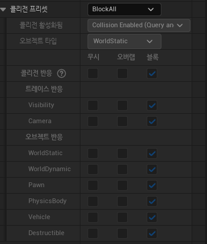

## Unreal Engine (BluePrint - 4)

UCapsuleComponent

---

- UObject

- UActorComponent (FTransforme)

- USceneComponent

- UPrimitiveComponent

- UShapeComponent

- UShphereComponent

- UCapsuleComponent

- UBoxComponent

 

USceneComponent

---
##### UCapsuleComponent

- UObject

- UActorComponent (FTransforme)

- USceneComponent

- UPrimitiveComponent

- UShapeComponent

- UShphereComponent

- UCapsuleComponent

- UBoxComponent

##### USceneComponent

FTransform은 Location(T), Rotation(R), Scale(S)을 가지고 있다.

Relative는 상대 거리를 만들어주는 것이다. 상대적 간격을 사용하는 이유는 부모에 상속받은 자식을 부모가 움직이면 같이 움직이게 하기 위해서 사용한다.

예를 들어 눈사람이 있다고 할 때 아래 눈덩이를 루트, 위에 눈덩이를 루트를 상속받은 자식이라고 한다. 눈사람을 움직일 때 해당 물체를 옆으로 옮길 때 아래 눈덩이(루트)만 움직이는 것이 아니라 위에 눈덩이(자식)을 같이 움직이게 해야 하기 때문에 상대적 간격은 중요한 부분이다.

 

Collision

---

Actor BeginOverlap은 충돌을 시작할 때 발생하는 Event이다.

Overlap은 충돌할 두 Collision이 둘 다 활성화되어야 발생한다.

ComponentOverlap은 충돌한 Actor 안에 있는 Collision을 말한다.

콜리전 프리셋을 이용하면 어떤 물체와 충돌할지 충돌하여도 통과가 가능한지를 정할 수 있다. Hit(Block)을 선택하면 충돌이 일어나고 경로를 막고 OverLap은 충돌이 일어나지만 경로를 막지 않는다.

 

피직스 시뮬레이트는 물리 법칙을 실행하는 것으로 콜리전 프리셋이 PhysicisActor로 바뀐다.

Set Collision Enabled는 Collision Type을 바꿀 수 있다.

 

Flynn

---

- SISD - 하나의 데이터를 하나가 처리

- SIMD (GPU) - 여러 개의 데이터를 하나가 처리

- MISD (이론 상 사용, 잘 사용 X) - 한 번에 데이터 여러 개를 명령어 하나로 처리

- MIMD (CPU) - 데이터 여러 개를 여러 명령어로 처리

 

UMaterialInterface

---

- UMaterialInterface

- UMaterial

- UMaterialInstance (Constant, 컴파일 하여 인스턴트, 에디터에서 바꿀 수 있음)

-  UMaterialInstanceDynamic (프로그램에서 인스턴트를 수정하도록 함)

Vector는 Double을 4개 가지고 Scalar은 1개 가진다.

Metalic은 금속도를 조정하는 것을 말한다.

Roughness 거칠기를 조정하는 것을 말한다.

 
