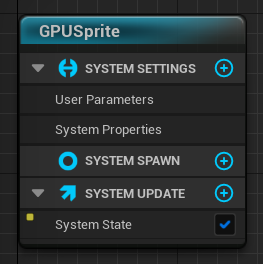
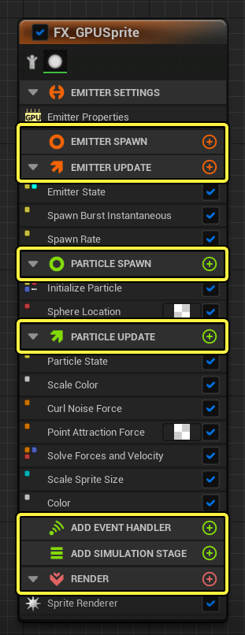
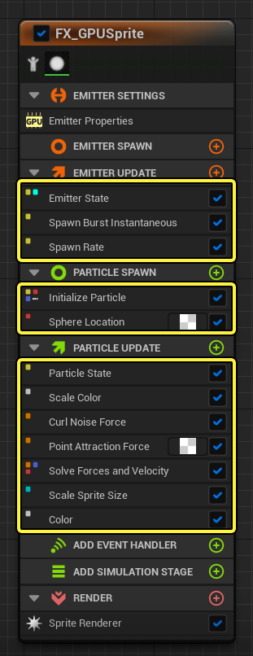

## Unreal Engine (Unreal C++ - 23)

Particle

---

언리얼에서 파티클 시스템을 이용하여 연기, 스파크, 화염 등에서 좀 더 복잡하고 독특한 이펙트를 만들 수 있다. 
파티클 시스템은 Cascade라는 통합된 모듈식 파티클 이펙트 에디터로 편집한다. Cascade는 실시간 피드백과 모듈식 이벤트를 편집할 수 있는 기능을 제공한다. 
파티클 시스템은 각 파티클에 적용되는 여러 가지 머티리얼이나 텍스처에도 관련이 있다. 
파티클 시스템은 파티클의 동작을 조절하고, 전체적인 외양과 느낌은 종종 머티리얼을 통해 조절된다.

 

Niagara

---

Niagara VFX 시스템에는 4가지의 시스템, 이미터, 모듈, 파라미터 컴포넌트가 있다.

 

시스템

---

이펙트 빌드에 필요한 모든 요소가 담긴 컨테이너로 시스템에서 다양한 빌딩 블록을 쌓아 전체적인 이펙트를 만들 수 있다. 
시스템 단계의 행동을 수정한 뒤 이펙트에 속하는 모든 요소에 적용이 가능하다.

타임라인 패널에서 포함된 이미터를 확인하고 이미터를 관리할 수 있다.

 

이미터

---

나이아가라 시스템에서 파티클이 생성되는 곳으로 파티클의 생성 방식, 시간 경과에 따라 파티클에서 발생하는 현상과 외관, 행동을 제어한다. 스택으로 구성되어 있고 스택 내에는 여러 그룹이 있어 개별 작업을 수행하는 모듈을 추가 가능하다.

- 이미터 스폰(Emitter Spawn) : 이미터가 CPU에서 처음 생성될 때 일어나는 것으로 초기 구성과 디폴트 값을 정의한다.

- 이미터 업데이트(Emitter Update) : CPU의 모든 프레임에서 발생하는 이미터 단계의 모듈을 정의한 것으로 모든 프레임에서 계속 스폰 할 파티클 스폰을 정의한다.

- 파티클 스폰(Particle Spawn) : 파티클이 처음 생성될 때 파티클당 한 번씩 호출되고 이 그룹에서 파티클의 생성 위치, 색, 크기와 같은 파티클의 초기화 디테일을 정의한다.

- 파티클 업데이트(Particle Update) : 각 프레임에서 파티클마다 호출되는 것으로 파티클의 수명에 따라 프레임별로 변경해야 하는 사항을 정의한다. 시간에 따른 파티클의 색 변화와 중력, 컬 노이즈, 포인트 어트랙션 등의 힘이 파티클에 미치는 영향을 예로 들 수 있다. 시간에 따라 파티클의 크기가 변하게 할 수도 있다.

- 이벤트 핸들러(Event Handler) : 특정 데이터를 정의하는 하나 이상의 이미터에 생성 이벤트를 만들 수 있고 생성된 이벤트에 반응하여 동작을 트리거 하는 다른 이미터에 수신 이벤트를 만들 수 있다.

- 렌더(Render) : 렌더 그룹에서는 파티클의 디스플레이를 정의하고, 파티클에 하나 이상의 렌더러를 설정할 수 있다. 머티리얼을 적용할 수 있는 파티클의 기반으로서 3D 모델을 정의할 경우, 메시 렌더러를 사용하는 것이 좋다. 스프라이트 렌더러를 사용하고 파티클을 2D 스프라이트로 정의도 가능하다. 여러 렌더러 중에 골라서 실험해 볼 수 있다.

 

모듈

---

이펙트의 기본 빌딩 블록으로 그룹에 모듈을 추가하여 스택을 만든다. 모듈은 위에서 아래로 순차적으로 처리된다.

모듈은 계산을 수행하는 컨테이너로 모듈에 데이터를 전달한 뒤 모듈 내부에서 해당 데이터에 관한 계산을 하고 이 데이터를 모듈의 끝에 작성한다.

모듈은 고급 셰이딩 언어(High-Level Shading Language, HLSL)를 사용하여 빌드 하지만, 노드를 사용하여 그래프에서 시각적으로 빌드 할 수 있다. 함수를 만들거나, 입력을 포함시키거나, 값 또는 파라미터 맵에 작성할 수 있다. 그래프의 CustomHLSL 노드를 사용하여 HLSL 코드 인라인을 작성하는 것도 가능하다.

 

파라미터

---

파라미터는 나이아가라의 데이터의 추상표현으로 파라미터 타입은 파라미터에 할당되어 파라미터가 표현하는 데이터를 정의한다. 

- 프리미티브(Primitive) : 각기 다른 정밀도와 채널 폭의 숫자 데이터를 정의한다.
- 열거형(Enum) : 명명된 값의 고정된 조합을 정의하고, 명명된 값 중 하나를 가정한다.
- 구조체(Struct) : 프리미티브와 열거형 타입을 결합한 조합을 정의한다.
- 데이터 인터페이스(Data Interfaces) : 외부 데이터 소스로부터 데이터를 제공하는 함수를 정의한다.