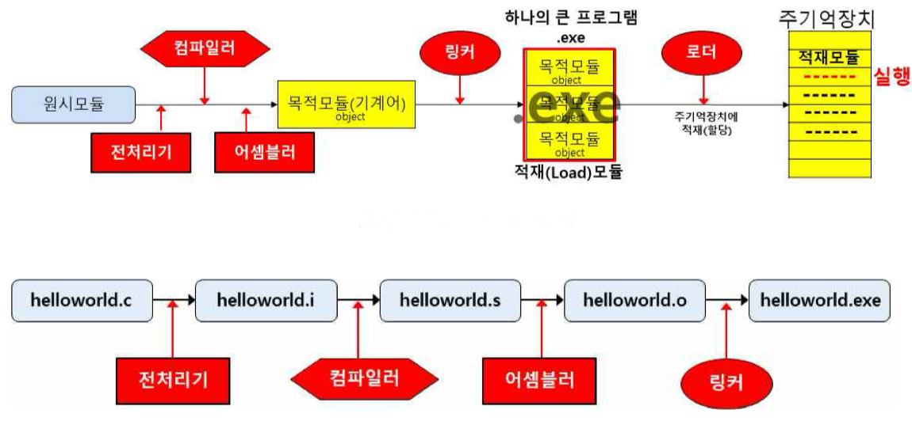

## 컴파일러

컴파일러

---

컴파일러는 고급언어로 쓰인 프로그램 전체를 컴퓨터에서 즉시 실행될 수 있는 형태의 목적 프로그램으로 번역한 후 링킹 작업을 통해 실행 가능한 프로그램으로 바꾸어 주는 번역 프로그램이다. 

원래의 코드를 소스 코드, 원시 코드라고 하고 출력된 코드를 목적  코드라고 한다. 이러한 번역하는 과정을 컴파일이라고 한다.

번역 시간이 오래 걸리지만, 한 번 번역 후에는 다시 번역하지 않아 실행 속도가 빠르다.

컴파일을 할 때 전처리기 → 컴파일러 → 목적 파일 → 링커 → 실행파일 순서대로 실행된다.

컴파일러는 일반적으로 이런 단계를 모듈화된 구성 요소로 구현하여 소스 입력에서 대상 출력으로의 변환을 효율적으로 설계하고 정확하게 수행한다. 

사용 언어에는 FORTRAN, COBOL, PASCAL, C, C++, ALGOL 등이 있다.

 

