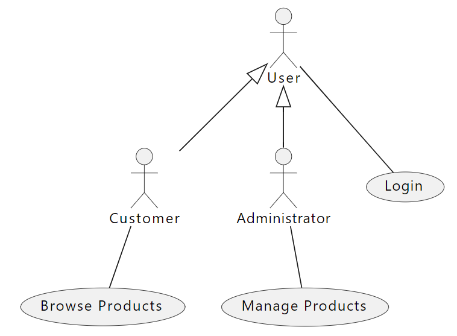

## UML Use-case 다이어그램

UML Use-case 다이어그램

---

Use Case 다이어그램은 행위 다이어그램(Behavior UML Diagrams)에 해당되는 것으로 외부에서 보는 시스템의 동작으로, 외부 객체들이 어떻게 상호작용하는지 모델링 한다. 유스 케이스 다이어그램은 사용자가 시스템과 상호작용할 수 있는 다양한 가능성을 그래픽으로 나타낸 것입니다. 이 다이어그램은 여러 유스 케이스와 시스템이 가지는 다양한 유형의 사용자를 보여주며, 종종 다른 유형의 다이어그램과 함께 사용됩니다. 유스 케이스는 일반적으로 원 또는 타원으로 표현되며, 액터(사용자)는 종종 막대기 형태의 사람 그림으로 표시된다.구성요소로는 Actor, Use Case, System이 있다.

유스케이스 자체는 모든 가능성을 상세히 탐구할 수 있지만, 유스케이스 다이어그램은 시스템에 대한 더 높은 수준의 개요를 제공하는 데 유용합니다. “유스케이스 다이어그램은 시스템의 청사진이다”라는 말도 있다. 유스케이스 다이어그램은 그 단순한 특성 덕분에 이해관계자들과의 소통 도구로 적합하다. 이러한 다이어그램은 현실 세계를 모방하려고 하고, 이해관계자가 시스템이 어떻게 설계될지를 이해할 수 있는 관점을 제공한다. 유스케이스 다이어그램은 이해관계자들에게 시스템의 의도를 더 단순화된 방식으로 전달했으며, “클래스 다이어그램보다 더 완전하게 해석”된다는 사실이 밝혀졌다.

 

