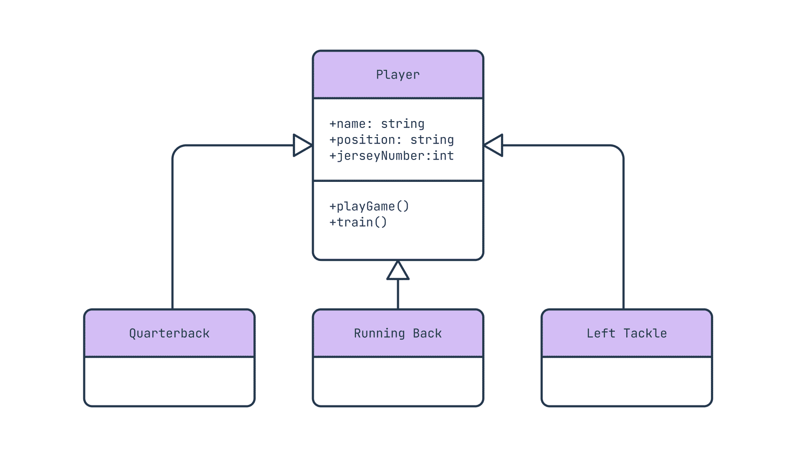

## UML Class Diagram

UML Class Diagram

---

클래스 다이어그램(Class Diagram)은 구조 다이어그램(Structural UML Diagram)에 해당된다. 시스템을 구성하는 클래스와 클래스가 가지는 속성, 클래스 사이의 관계를 표현한 다이어그램이다. 시스템 구조 파악 및 구조상 문제점을 도출할 수 있다. 시스템 구조 파악 및 구조상 문제점을 도출할 수 있다. 

객체, 클래스, 속성, 오퍼레이션 및 연관관계를 이용하여 시스템을 나타낸다. 오퍼레이션이란 클래스의 동작을 나타내며, 클래스에 속하는 객체에 적용될 메서를 정의한다. 시스템 구조를 나타내며, 클래스 속성 및 클래스들의 관계를 이용하여 시스템을 나타낸다. 클래스들을 표현하고 그 클래스들의 정적인 관계를 표현한다. 클래스는 각 객체의 공통 요소를 추상화(추상화는 속성과 메서드를 찾아내는 것) 하고, 그것을 틀로서 정의한 것이다. 한 클래스의 속성(Attribute)과 메서드(연산)을 표현한다.

클래스 다이어그램의 구성으로는 세 개의 구획으로 나뉜다. 

- 상단 구획 : 클래스의 이름을 표시, 볼드체, 중앙 정렬, 첫 글자는 대문자로 표기
- 중앙 구획 : 클래스의 속성(attributes)을 표시, 좌측 정렬, 첫 글자는 소문자로 표기
- 하단 구획 : 클래스가 실행할 수 있는 메서드(operations)를 표시, 좌측 정렬, 첫 글자는 소문자 표기

클래스 다이어그램은 시스템 설계 시 여러 클래스를 식별하여 그룹화하고, 클래스 간의 정적인 관계를 파악하는 데 사용한다. 상세 설계에서는 개념적 설계에 정의된 클래스를 하위 클래스(subclasses)로 나눌 수 있다.

 

