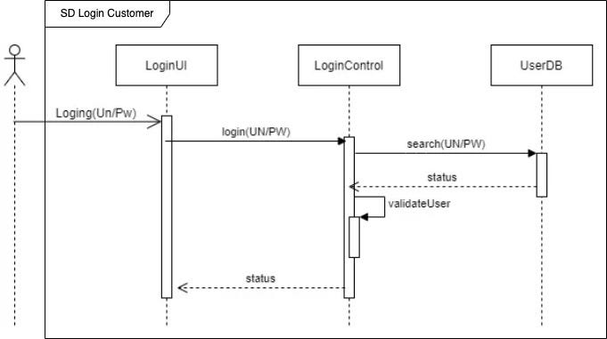

## UML Sequence Diagram

UML Sequence Diagram

---

시퀀스 다이어그램은 행위 다이어그램(Behavioral UML Diagram)에 포함된다. 객체들 간의 메시지 교환을 시각화하여 나타낸다. 동적인 행위를 순서 흐름에 기술하는 표현법으로 시간(Time), 객체(Object), 메시지(Message) 등으로 구성된다.

시퀀스 다이어그램은 유스케이스의 특정 시나리오에서 외부 액터(actor)가 생성하는 이벤트, 이벤트의 순서, 그리고 시스템 간 이벤트를 나타낸다. 시스템 경계(system boundary)를 넘어가는 이벤트, 즉 액터와 시스템 간의 상호작용을 강조합니다. 유스케이스의 주요 성공 시나리오와 복잡하거나 빈번한 대체 시나리오에 대해 작성해야 합니다.

시퀀스 다이어그램은 시스템 설계 과정에서 기능적 흐름과 상호작용을 명확히 이해하고, 외부와 내부의 관계를 구분하며 시스템 동작을 시각화하는데 유용합니다. 복잡한 프로세스를 단순화하여 유스케이스 중심의 분석 및 설계 작업에 기여한다.

 

