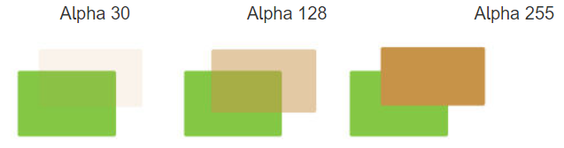

## 알파 블렌딩

알파 블렌딩

---

알파 블렌딩(Alpha Blending)은 다른 말로 알파 합성(Alpha Composition)으로 하나의 이미지를 배경과 결합하여 부분적 또는 완전한 투명감을 만드는 과정을 말한다. 주로 픽셀 단위의 요소들을 별도의 패스 또는 레이어로 렌더링한 다음, 생성된 2D 이미지를 단일 최종 이미지인 합성 이미지(Composite)로 결합하는데 유용하다. 합성은 컴퓨터로 렌더링된 이미지 요소를 실제 촬영한 장면과 결합할 때 영화에서 널리 사용된다.

컴퓨터 그래픽스에서 반투명 효과를 구현하기 위해 두 개의 이미지를 합성하는 기술이다. 이때 각 픽셀의 색상 값은 불투명도를 나타내는 알파값에 따라 조합된다. 알파는 0에서 1사이의 값으로 0은 완전히 투명한, 1은 완전히 불투명함을 의미한다.

이미지의 픽셀 요소를 올바르게 결합하려면 각 요소의 색상 외에 연관된 매트를 유지하는 것이 필요하다. 매트 레이어는 해당 요소의 커버리지 정보를 포함하며, 이를 통해 이미지에서 그려진 부분과 빈 부분을 구분할 수 있다. 

가장 기본적인 이미지 결합 작업은 한 이미지를 다른 이미지 위에 배치하는것이지만 다양한 블렌드 모드를 사용할 수 있다.

 

