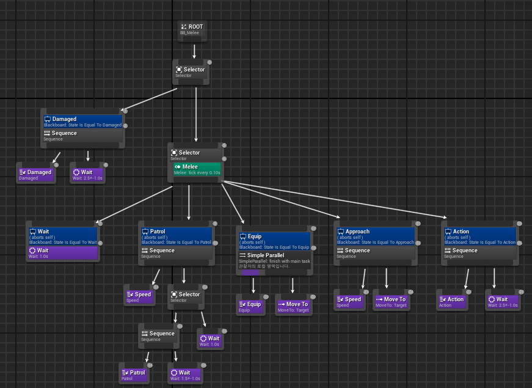

## Behavior Tree

Behavior Tree

---

행동 트리(Behavior Tree)는 컴퓨터 과학, 로봇 공학, 제어 시스템, 비디오 게임에서 사용되는 계획 실행의 수학적 모델입니다. 이는 모듈식 방식으로 제한된 작업 집합 간의 전환을 설명합니다. 행동 트리의 강점은 단순한 작업이 어떻게 구현되었는지에 대해 신경 쓰지 않고, 단순한 작업들을 결합하여 매우 복잡한 작업을 생성할 수 있다는 점이 있다.

행동 트리는 계층적 상태 기계(Hierarchical State Machine)와 유사한 점이 있지만, 주요 구성 요소가 상태(State)가 아니라 작업(Task)라는 차이점이 있다. 행동 트리는 인간이 이해하기 쉬운 구조를 제공하여 오류 가능성을 줄여주고, 게임 개발에서 많이 사용된다.

행동 트리는 AI의 행동만 프로그래밍하고 나무 구조를 설계하여(드래그 앤 드롭) 하여 복잡한 행동을 생성할 수 있다. 나무 구조의 리프(leaf) 노드는 구체적인 행동을, 내부(inner) 노드는 의사결정 과정을 결정한다. 행동 트리는 시각적으로 직관적이고 설계, 테스트 및 디버깅이 쉬우며, 다른 행동 생성 방법보다 더 높은 모듈성, 확장성, 재사용성을 제공한다.

행동 트리는 위에서 아래 왼쪽에서 오른쪽 방향으로 진행된다. 언리얼에서 행동 트리는 Root, Branch, Leaf로 구성된다. Root는 시작하는 노드로 부모가 없고 진행이 다 끝나면 다시 Root로 돌아온다. Branch는 언리얼에서 컴포짓으로 Sequence, Selector, Simple Paraller이 있다. Leaf는 Task로 여러 가지 종류가 있고 블루프린트나 C++을 이용하여 원하는  Task를 만들 수 있다. Task는 행동 트리의 끝에 위치한다. 행동 트리는 루트에서 시작되고  특정 주기로 틱을 실행한다. 틱은 자식 노드의 실행을 허용하는 신호로 언리얼에서는 InProgress, Successed, Failed, Aborted가 있다. InProgress는 행동이 실행 중, Successed는 성공,  Failed는 실패, Aborted는 중단을 의미한다.

 

