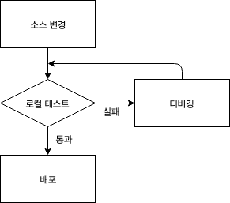

## 단위 테스트(Unit Test)

단위 테스트(Unit Test)

---

개발자가 구현 단계에서 실시하는 모듈 테스트이다. 화이트 박스 테스트 기법을 이용한다.

개별적인 모듈에 대한 테스트이며 테스트 드라이버(driver)와 테스트 스텁(stub)을 사용할 수 있다.

구현 단계에서 각 모듈의 개발을 완료한 후 개발자가 명세서의 내용대로 정확히 구현되었는지 테스트한다.

모듈 내부의 구조를 구체적으로 볼 수 있는 구조적 테스트를 주로 시행한다.

상위 모듈의 역할을 하는 가상의 모듈을 테스트 드라이버(test driver)라 하고 그 역할은 테스트할 모듈을 호출하는 것이다.

테스트 완료 후 그 결과값을 받는 역할을 하는 가상의 모듈을 테스트 스텁(Stub)이라 한다.

테스트할 모듈을 호출하는 모듈도 있고, 테스트할 모듈이 호출하는 모듈도 있다.

 

##### 테스트 드라이버(Test Driver)

필요에 따라 매개 변수를 전달하고 모듈을 수행한 후의 결과를 보여줄 수 있다.

단위 테스트에서 테스트의 대상이 되는 하위 모듈을 호출하고, 파라미터를 전달하는 가상의 모듈로 상향식 테스트에서 사용된다. 

Driver는 제어,  조종을 한다는 뜻을 담고 있다.

Test Driver는 Dummy Driver이고 나머지  Dummy Modele은 Stub가 된다.

 

##### 스텁(Stub)

제어 모듈이 호출하는 타 모듈의 기능을 단순히 수행하는 도구이다.

골격만 있는 또는 특별한 목적의 소프트웨어 컴포넌트를 구현한 것이다.

스텁을 호출하거나 또는 스텁에 의존적인 컴포넌트를 개발하거나 테스트를 할 때 사용된다.

스텁은 호출된 컴포넌트를 대체한다.

 

