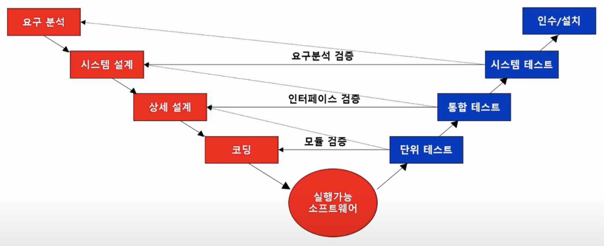

## 통합 테스트(Intergration Test)

통합 테스트(Intergration Test)

---

통합 테스트는 시스템을 구성하는 모듈을 모아 통합적으로 테스트한다. 단위 검사가 끝난 모듈들을 통합하여 모듈 간의 인터페이스 관련 오류를 찾는 검사 방법이다. 종류 : 모듈을 통합하는 방식에 따라 빅뱅(big-bang) 기법, 하향식(Top-down) 기법, 상향식(Bottom-up) 기법을 사용한다.

소프트웨어 개발에서 개별적으로 테스트된 모듈(또는 컴포넌트)을 결합하여, 이들이 서로 올바르게 작동하는지 확인하는 테스트 단계이다. 이 과정은 모듈 간의 인터페이스와 데이터 교환을 중심적으로 검증하며, 전체 시스템의 안정성과 신뢰성을 높이는 데 중요한 역할을 합니다.

통합 테스트의 과정은 테스트 계획 수립 → 테스트 환경 설정 → 테스트 수행 → 결과 분석 및 문제 해결 → 재테스트이다.

- 테스트 계획 수립 - 테스트 대상 모듈, 통합 순서, 테스트 케이스 정의

- 테스트 환경 설정 - 필요한 모듈, 인터페이스, 데이터 준비

- 테스트 수행 - 계획된 순서에 따라 통합 및 테스트 진행

- 결과 분석 및 문제 해결 - 발생한 오류를 기록하고 수정

- 재테스트 - 수정된 모듈을 다시 테스트하여 문제가 해결되었는지 확인

 

