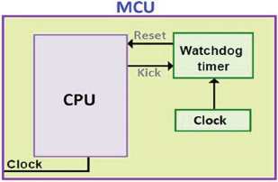

## 워치독 타이머(Watchdog Timer)

워치독 타이머(Watchdog Timer)

---

워치독 타이머는 컴퓨터의 오작동을 탐지하고 복구하기 위해 쓰이는 전자 타이머이다. 정상 작동 중의 컴퓨터는 시간이 경과하거나 “타임아웃”이 되는 것을 막기 위해, 정기적으로 워치독 타이머를 재가동 시킨다. 만약, 하드웨어의 결함 혹은 프로그램 오류로 인해 컴퓨터가 워치독을 재가동하는데 실패하면, 타이머가 시간을 두고 타임아웃 신호를 생성한다. 이 타임아웃 신호는 여러 시정 조치를 취하는데 쓰인다. 이 시정 조치란 일반적으로 컴퓨터 시스템을 안전한 상태로 유지하는 것과 정상적인 시스템 작동으로 원상 복귀 시키는 것을 포함한다.

워치독 타이머는 인간이 쉽게 접근할 수 없거나 오류에 제때 반응하기 힘든 컴퓨터 제어 장비에서 일반적으로 찾을 수 있다. 소프트웨어가 멈추는 경우, 많은 임베디드 시스템들은 사람이 재부팅해 주는 것에만 의존할 수 없다. 따라서 그들은 반드시 자립적이어야 한다.

 

