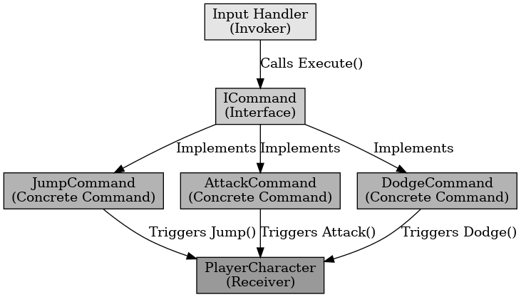

## 커맨드 패턴

커맨드 패턴

---

커맨드 패턴은 디자인 패턴 중 행위 패턴으로 요청을 캡슐화하여 객체로 변환하고, 실행을 요청하는 쪽과 수행하는 쪽을 분리하는 패턴을 말한다.
명령을 객체로 추상화하여 실행, 취소, 저장을 유연하게 처리할 수 있도록 설계하는 패턴이다.

언리얼 엔진에서 플레이어의 액션 시스템을 만드는데 커맨드 패턴을 사용할 수 있다. 플레이어의 공격, 점프, 회피와 같은 행동을 커맨드로 구현하여 관리가 가능하다.
또 Undo를 이용하여 특정 동작을 취소 가능하다.

커맨드 패턴은 요청을 커맨드로 변환하여 실행과 요청을 분리하는 디자인 패턴이다.