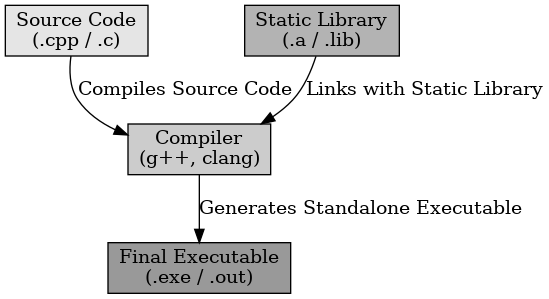
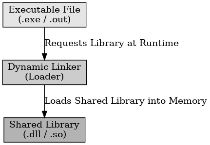

## static/dynamic linking 차이

static/dynamic linking 차이

---

프로그램을 컴파일하고 실행할 때, 라이브러리를 포함하는 방식에는 정적 링크와 동적 링크가 있다.

 

static linking 

---

라이브러리를 실행 파일에 직접 포함하여 생성하는 방식으로 컴파일 시간에 필요한 모든 코드가 실행 파일에 포함된다.

static linking의 장점으로는 모든 코드가 포함되어 있어 로딩이 불필요하기 때문에 실행 속도가 빠르다. 또, 독립적인 실행 파일을 생성하는데 이는 배포 시 추가 라이브러리는 필요 없다. 

단점으로는 모든 라이브러리 코드가 포함되어 파일 크기가 크고 라이브러리 변경 시 전체 리빌드를 해야 하기 때문에 업데이트가 불편하다.

 

dynamic linking 

---

라이브러리를 실행 파일과 별도로 유지하는 방식으로 프로그램 실행 시 필요한 라이브러리를 동적으로 로드하여 사용한다.

dynamic linking의 장점으로는 라이브러리를 실행 파일에 포함하지 않아 파일 크기가 작다. 라이브러리만 변경해도 프로그램 수정 없이 사용 가능해 업데이트가 편하다.

단점으로는 실행 시 추가적인 라이브러리가 필요하고 실행 중 라이브러리를 로드하는 시간이 필요하기 때문에 런타임 오버헤드가 발생한다.

