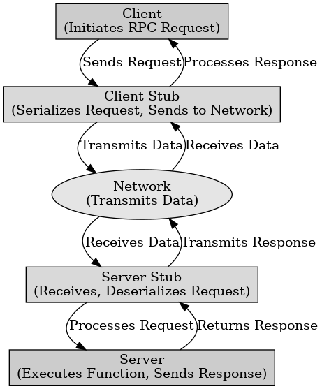

## RPC(Remote Procedure Call)

RPC(Remote Procedure Call)

---

RPC (Remote Procedure Call)은 네트워크를 통해 원격 시스템의 함수를 로컬 함수처럼 호출하는 통신 방법이다. 다른 컴퓨터(서버)에 있는 함수를 마치 내 컴퓨터(클라이언트)에서 실행하는 것처럼 호출할 수 있다.

RPC의 동작 순서는 클라이언트에서 원격 함수 호출 -> 클라이언트 스텁이 요청을 직렬화하여 서버로 전송 -> 서버가 요청을 수신하고 함수로 실행 -> 결과를 클라이언트에게 반환 -> 클라이언트가 응답을 받아 원격 호출 결과를 사용 순서이다.

RPC의 장점은 분산 시스템 구현이 쉬워 원격 함수 호출을 로컬 함수처럼 사용이 가능하다. 클라이언트, 서버 사이의 데이터의 직렬화와 역직렬화를 자동으로 처리한다. 다양한 프로그래밍 언어가 호환이 가능하다.

단점으로는 로컬 함수 호출보다 속도가 느려 네트워크 지연이 발생한다. 네트워크 오류, 서버 다운 시 예외 처리가 필요하고 원격 함수 호출이기 때문에 인증 및 권한 관리가 필요하다.

