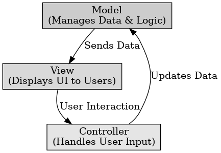

## MVC(Model-View-Controller) 아키텍처

MVC(Model-View-Controller) 아키텍처

---

MVC (Model-View-Controller)는 소프트웨어 설계 패턴 중 하나로, 애플리케이션을 세 개의 주요 컴포넌트(Model, View, Controller)로 분리하여 유지 보수성과 확장성을 높이는 아키텍처 패턴이다.

Model : 애플리케이션의 데이터와 비즈니스 로직을 담당하고 데이터베이스와 상호작용하여 CRUD(Create, Read, Update, Delete) 작업 수행한다. View나 Controller와 직접적으로 관계없이 독립적으로 동작 가능하다.

View : 사용자에게 데이터를 표시하는 역할 (HTML, CSS, JS 등)으로 Model의 데이터를 표시하고 Controller의 지시에 따라 UI를 업데이트한다. 직접 Model을 수정하지 않고 Controller를 통해 데이터를 요청한다.

Controller : 사용자의 입력을 받아 Model과 View 사이에서 데이터를 처리하고 전달하는 역할로 사용자가 요청한 데이터를 Model에서 가져와 View로 전달한다. Model과 View의 중재자 역할을 하며, 비즈니스 로직을 실행한다.

MVC의 장점은 UI와 데이터가 분리되어 유지 보수가 용이하고 Model과 View를 독립적으로 개발이 가능하여 재사용성이 증가한다. Model과 Controller를 독집적으로 테스트 가능하다.

단점은 단순한 프로젝트에서는 코드가 많아져 복잡성이 증가하고 처음부터 명확한 구조 설계가 필요하여 초기 설계가 부담된다. 여러 컴포넌트가 상호작용하기 때문에 데이터 흐름 파악이 어려울 수 있다.

