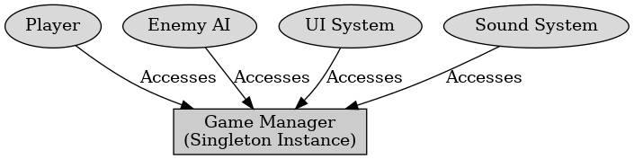

## 싱글톤 패턴(정의, 문제점)

<p style = "color:#8f7cee; font-size:25px; font-weight:bold">
싱글톤 패턴(정의, 문제점)
</p>

---

싱글톤 패턴은 디자인 패턴중 행위 패턴에 해당되는 것으로 클래스의 인스턴스를 단 하나만 생성하도록 보장한다. 어떤 클래스가 한 번만 생성되며, 동일한 객체를 모든 코드에서 공유하도록 하는 방식이다.

##### 싱글톤 패턴의 활용 예시

```C++
class USingleton : public UObject {
  GENERATED_BODY()

private:
  static USingleton* Instance;
  
public:
  static USingleton* GetInstance() {
      if (!Instance) {
         Instance = NewObject<USingleton>();
      }
      return Instance;
  }
};
```

싱글톤 패턴의 문제점은 멀티스레드 환경에서 인스턴스 생성이 동시 호출되면 여러 개의 인스턴스가 생성될 수 있다.
싱글톹 객체는 전역적으로 사용되기 떄문에 테스트할 때 특정 객체를 주입이 어렵다. 이는 의존성 주입을 사용하여 테스트 가능하도록 설계하면 해결이 가능하다.
싱글톤 객체는 프로그램 종료 시에 계속 메모리에 남아있어 메모리 누수 위험이 있다. 이는 스마트 포인터를 사용하여 자동으로 메모리 관리하면 해결이 된다.

싱글톤 패턴은 전역적으로 단 하나의 객체만 존재하도록 보장하는 디자인 패턴이다.

