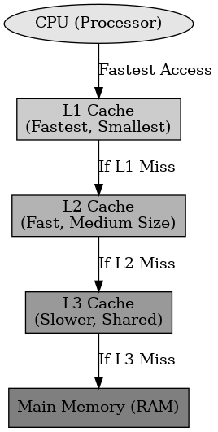

## 캐시메모리

캐시메모리

---

캐시메모리는 CPU와 메인 메모리(RAM) 사이의 속도 차이를 줄이기 위해 사용하는 메모리를 말한다.
캐시메모리는 자주 사용하는 데이터를 미리 저장하여 RAM보다 빠르게 접근할 수 있다.

캐시메모리의 주요 개념에는 캐시 히트, 캐시 미스, 캐시 블록, 캐시 일관성이 있다.

- 캐시 히트 (Cache Hit) : CPU가 요청한 데이터가 캐시 메모리에 존재하는 경울호 RAM에 접근할 필요 없이 빠르게 데이터를 반환한다.
- 캐시 미스 (Cache Miss) : CPU가 요청한 데이터가 캐시 메모리에 없는 경우에 RAM에서 데이터를 가져와야 하므로 속도가 느려진다.
- 캐시 블록 (Cache Block) : 캐시 메모리는 데이터 블록 단위로 저장하여 한 번에 어려 개의 데이터를 가져와 저장하여 성능을 향상시켜준다.
- 캐시 일관성 (Cache Coherence) : 멀티코어 시스템에서 각 CPU의 캐시가 일관된 데이터를 유지하는 방법이다.

