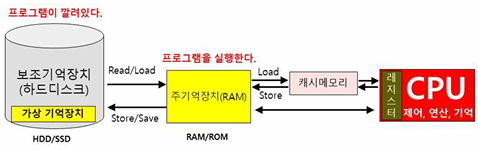

## 가상메모리

가상메모리

---

주기억장치의 이용 가능한 기억 공간보다 훨씬 큰 주소 지정을 할 수 있도록 하는 기법이다.
보조기억장치(HDD)의 일부를 주기억장치처럼 사용하는 것으로 용량이 작은 주기억장치를 큰 용량을 가진 것처럼 운영체제를 속여서 사용하는 기법이다.
프로그램을 여러 개의 작은 블록 단위로 나누어 보관하고, 프로그램 실행되면 요구되는 블록만 주기억장치에 불연속적으로 할당해 처리한다. 
가상 메모리는 주기억장치의 크기보다 큰 프로그램을 실행하기 위해 사용한다.
주기억장치의 이용률과 다중 프로그램의 효율을 높일 수 있다.
주기억장치의 물리적 크기의 한계를 해결하기 위한 기법으로, 주기억장치의 크기와 관계없이 프로그램이 메모리의 주소를 논리적인 관점에서 참조할 수 있다.
가상기억장치에 저장된 프로그램을 실행하기 위해서 가상기억장치의 주소를 주기억장치의 주소로 바꾸는 주소 변환 작업이 필요하다.
프로세스에서 사용되는 가상주소를 주기억장치의 물리 주소로 변환하는 것은 프로세스의 실행 중에 이루어진다.
가상 메모리는 페이징 기법과 세그먼테이션 기법으로 나뉜다.

 

가상메모리 단점

---

보조기억장치를 주기억장치처럼 사용하여 속도가 떨어진다.
가상메모리 용량만큼 컴퓨터의 용량을 차지하게 된다.
