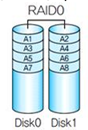
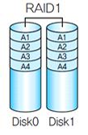
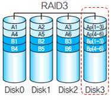
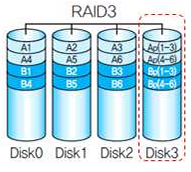
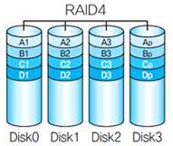
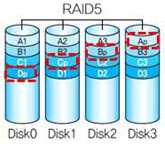
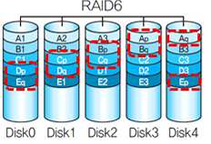

## RAID

RAID (Redundant Array of Inexpensive/Independent Disks)

---

RAID는 데이터를 분할해서 복수의 자기 디스크 장치에 대해 병렬로 데이터를 저장하고 읽는 방식이다.
RAID를 이용해 디스크의 기계적인 장애로부터 사용자의 데이터를 안전하게 이용할 수 있다.
여러 디스크를 병렬로 연결하여 사용하는 기법으로서 접근 속도와 데이터 보존 신뢰가 높을수록 높은 등급을 받는 6 단계로 구분할 수 있다.

 

RAID 0 (Stripe, Concatenate)

---

무작위로 빠르게 입력되는 병렬처리 방식으로 Disk Striping은 데이터를 나누어 저장하지만 중복 저장하지 않아 디스크 장애 발생 시 복구할 수 없다.
Data를 Disk에 bit 단위로 분산 저장한다.
RAID 0의 장점으로는 속도가 빠르고 단점으로는 장애 발생 시 모두 영향을 받는다.

 

RAID 1 (Mirroring)

---

미러링 즉 백업용 드라이브를 이용해 데이터를 완전 이중화하여 복사해 저장하는 방식으로 저장되는 데이터를 동일한 디스크에 Mirroring을 수행한다.
RAID 1의 장점으로는 디스크 중복 쓰기로 뛰어난 견고성을 가지며 장애 시에 복
구가 가능하다.
단점으로는 디스크 공간 효율이 2배 하락하고 RAID 1은 디스크 미러링
(disk mirroring) 방식으로, 디스크 오류 시 데이터 복구가 가능하지
만 디스크 용량의 효율성이 떨어진다.

 

RAID 2 (Hamming Code ECC)

---

해밍코드 방식의 에러 체크로 RAID 0 + 해밍코드의 구조를 가지고 있다.
Bit 레벨의 Striping과 Hamming Code를 이용해 오류를 복구한다.
현재까지의 개념으로 RAID 2는 RAID 3에 비해 장점이 없다

 

RAID 3 (Parity ECC)

---

패리티 방식의 에러 체크로 RAID 0 + 패리티체크 구조를 가지고 있다.
Byte 레벨의 Striping과 Parity 사용하고 Parity 정보를 별도 Disk에 Byte 단위로 분산 저장한다.
RAID 3은 쓰기 동작 시 시간 지연이 발생한다.

 

RAID 4 (Parity ECC, Block 단위 I/O)

---

Block 레벨의 Striping과 Parity 사용하고 데이터는 Block 단위로 데이터 디스크에 분산 저장된다.
RAID 4는 데이터를 블록 단위로 여러 디스크에 분할 저장하는 방식으로, 오류의 검출 및 정정을 위해 별도의 패리티 비트를 사용한다.

 

RAID 5 (Parity ECC, Parity 분산 저장)

---

Block 레벨의 Striping과 Parity 사용하고 Parity를 분산 저장해 안정성이 향상되었다.
RAID 5는 패리티 블록들을 여러 디스크에 분산 저장하는 방식으로, 단일 오류 검출 및 수정이 가능하다.

 

RAID 6 (Parity ECC, Parity 분산 복수 저장)

---

Block 레벨의 Striping과 Double Parity 사용하고 분산 Parity가 적용된 RAID5의 안전성 향상을 위해 Parity를 다중화하여 저장한다.

