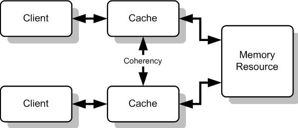

## 캐시메모리 일관성

캐시메모리 일관성

---

캐시메모리 일관성이란 다중 프로세서 시스템에서 각 프로세서가 가진 캐시 메모리와 메인 메모리 간의 데이터가 일관성을 유지하는 것을 말한다. 
다중 프로세서에서는 각 프로세서가 자체적인 캐시를 가져 여러 개의 캐시가 동일한 메모리 주소에 대해 서로 다른 값을 가지는 문제가 생길 수 있는데 이를 캐시 연관성 문제라고 한다.
캐시 일관성을 유지하기 위해서는 다른 프로세서가 갱신한 캐시 값을 다른 프로세서에서 사용할 수 있도록 해야 한다. 

캐시 일관성의 구조는 디렉터리 기반 일관성 구조는 캐시 블록의 공유 상태, 노드 등을 기록하는 저장 공간인 디렉터리를 이용하여 관리하는 구조를 가지고 있다.

스누핑(snooping)은 주소 버스를 항상 감시하여 캐시 상의 메모리에 대한 접근이 있는지를 감시하는 구조이고고 다른 캐시에서 쓰기가 발생하면 캐시 컨트롤러에 의해서 자신의 캐시 위에 있는 복사본을 무효화한다.

