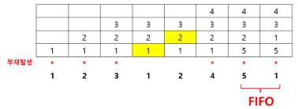
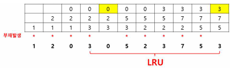
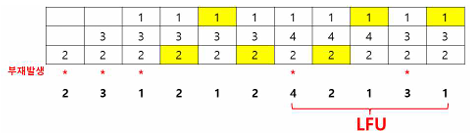

## 캐시메모리 교체정책

캐시메모리 교체정책

---

캐시메모리의 교체정책은 총 7가지 Random, FIFO, LRU, LFU, OPT, NUR, SCR이 있다.

- Random : 교체될 Page를 임의로 선정하고 오버헤드가 적다.
- FIFO (First In First Out) : 주기억장치 내에 오래 있었던 Page를 교체한다. 자주 사용되는 Page가 교체될 우려가 있다. 빌라디의 모순(페이지 프레임 수가 증가될 때 페이지 부재가 증가하는 현상)이 일어날 수 있다.
- LRU (Least Recently Used) : 가장 오랫동안 사용되지 않은 Page 교체(최근에 가장 적게 쓰인 페이지 교체)한다. Time stamping에 의한 오버헤드가 발생한다. 
- LFU (Least Frequently Used) : 사용 횟수가 가장 적은 Page 교체한다. 최근 적재된 Page가 불리할 수 있다. 
- OPT (Optimal) : 향후 참조될 가능성이 없는 Page를 교체한다. 이론적으로 최적의 페이지 교체 기법이나 실현이 불가능하다.
- NUR (Not Used Recently) : 참조 비트와 수정 비트에 의해 하드웨어에서 비트값을 조사하여 최근에 사용되지 않은 페이지를 교체한다. 최근 참조된 페이지를 보호하며, NUR에서 기회 할당 한 번 더 제공한다.
- SCR (Second Chance Replacement) : 최초 참조비트를 1로 설정하고, 1인 경우 0으로 셋트, 0인 경우 교체한다.  NUR에서 기회를 한 번 더 준다.

 

FIFO (First In First Out)

---

주기억장치 내의 오래 있었던 page 교체하는 방법이다. 
 
페이지 프레임이 4개이고 페이지 참조 순서가, 1, 2, 3, 1, 2, 4, 5, 1일 때, FIFO 교체 알고리즘을 적용하면 아래와 같은 결과가 나온다.

 

LRU (Least Recently Used)

---

가장 오랫동안 사용되지 않은 Page 교체하는 방법이다. 

페이지 프레임이 3개이고 페이지 참조 순서가 1, 2, 0, 3, 0, 5, 2, 3, 7, 5, 3 일 때, LRU 교체 알고리즘을 적용하면 아래와 같은 결과가 나온다.

 

LFU (Least Frequently Used)

---

사용 횟수가 가장 적은 Page 교체하는 방법이다.

페이지 프레임이 3개이고 페이지 참조 순서가 2, 3, 1, 2, 1, 2, 4, 2, 1, 3, 1 일 때, LFU 교체 알고리즘을 적용할 경우 다음과 같은 결과가 나온다.

