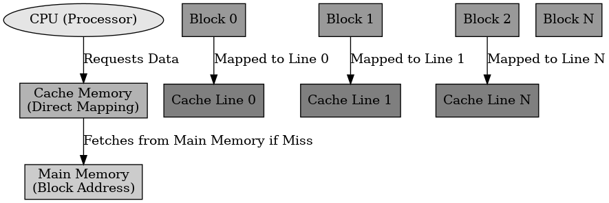
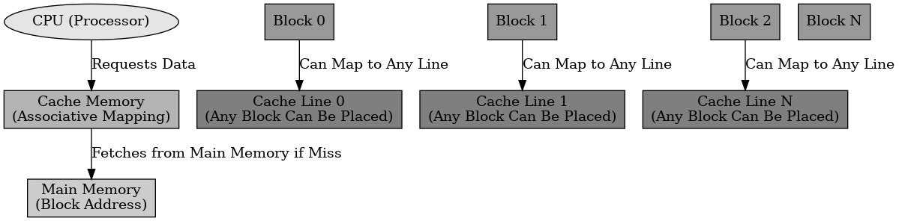
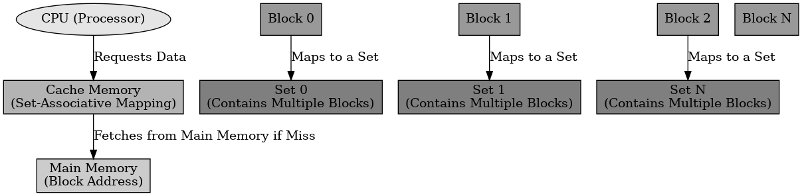

## 캐시메모리 매핑

캐시메모리 매핑

---

캐시 메모리 매핑은 주기억장치의 블록을 캐시 메모리에 저장하는 방식을 결정하는 것이다.
캐시는 용량이 제한적이여, 어떤 데이터를 저장하고 언제 교체할지 관리하는 것이 중요하다.
매핑 방식에는 직접 매핑, 완전 연관 매핑, 집합 연관 매핑이 있다.

 

직접 매핑(Direct Mapping)

---

직접 매핑은 특정 메모리 블록이 캐시의 특정 위치(Index)에만 저장되는 방식이다.
메모리 주소의 일부를 인덱스로 사용하여 캐시의 특정 라인에 저장한다.
속도가 빠르지만 충돌이 자주 발생할 수 있다.

 

완전 연관 매핑 (Fully Associative Mapping)

---

연관 매핑은 메모리 블록이 캐시의 어느 위치에든 저장될 수 있는 방식이다.
태그(Tag)를 사용하여 모든 캐시 블록을 검색하여 데이터를 찾고 충돌이 없는 반면 검색 시간이 오래 걸릴 수 있다.

 

집합 연관 매핑 (Set Associative Mapping)

---

집합 연관 매핑은 직접 매핑과 완전 연관 매핑을 합친 방식이다.
캐시를 여러 개의 집합으로 나누고, 특정 집합 내에서만 데이터가 저장될 수 있도록 제한한다.

