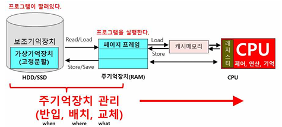

## 가상메모리 페이지 교체 알고리즘

가상메모리 페이지 교체 알고리즘

---

가상메모리 페이지 교체 알고리즘은 어떤 프로그램을 동작해 주기억장치에 새로운 페이지가 들어와야 할 때 공간 확보가 필요하다. 이때 주기어강치에 있던 기존 페이지 몇 개를 가상메모리로 보내야 할 때 어떤 페이지를 보낼 것인지를 정하는 알고리즘이다.

 

가상메모리 페이지 교체 알고리즘 종류

---

교체 알고리즘의 종류에는 7가지가 있다. 

- Random : 교체될 Page를 임의로 선정하고 오버헤드가 적다.
- FIFO (First In First Out) : 주기억장치 내에 오래 있었던 Page를 교체한다. 자주 사용되는 Page가 교체될 우려가 있다. 빌라디의 모순(페이지 프레임 수가 증가될 때 페이지 부재가 증가하는 현상)이 일어날 수 있다.
- LRU (Least Recently Used) : 가장 오랫동안 사용되지 않은 Page 교체(최근에 가장 적게 쓰인 페이지 교체)한다. Time stamping에 의한 오버헤드가 발생한다. 
- LFU (Least Frequently Used) : 사용 횟수가 가장 적은 Page 교체한다. 최근 적재된 Page가 불리할 수 있다. 
- OPT (Optimal) : 향후 참조될 가능성이 없는 Page를 교체한다. 이론적으로 최적의 페이지 교체 기법이나 실현이 불가능하다.
- NUR (Not Used Recently) : 참조 비트와 수정 비트에 의해 하드웨어에서 비트값을 조사하여 최근에 사용되지 않은 페이지를 교체한다. 최근 참조된 페이지를 보호하며, NUR에서 기회 할당 한 번 더 제공한다.
- SCR (Second Chance Replacement) : 최초 참조비트를 1로 설정하고, 1인 경우 0으로 셋트, 0인 경우 교체한다.  NUR에서 기회를 한 번 더 준다.

