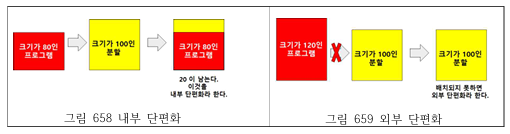
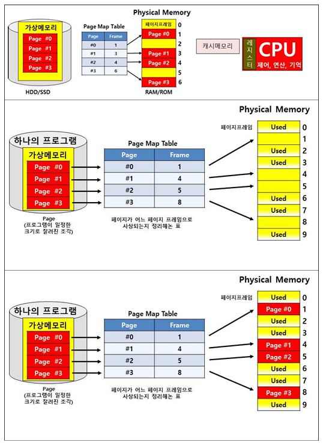

## 가상메모리 페이징 기법

가상메모리 페이징 기법

---

가상 메모리 페이징 기법은 가상기억장치에 보관되어 있는 프로그램과 주기억장치의 영역을 동일한 크기로 나눈 후 나눠진 페이지를 동일하게 나눠진 주기억장치 영역에 적재시켜 실행하는 방법이다.
페이징 시스템은 주기억장치에 적재될 페이지가 주기억장치의 가용 페이지 프레임 어디에 적대되어도 무관하므로 배치 기법이 불필요하다.
페이지 크기와 공간은 가상기억장치와 주기억장치의 페이지 크기가 같은 페이지 프레임으로 나누어 사용된다. 따라서 최초, 최적, 최악 등 배치 기법이 필요 없다.
외부 단편화는 발생하지 않지만 내부 단편화는 발생할 수도 있다.

페이지의 크기가 작아지면 페이지 맵 테이블의 크기는 커진다.
페이지가 커지면 페이지 맵 테이블의 크기는 작아지고 내부 단편화는 증가한다.

 

페이징 기법의 장점

---

세그먼트 테이블과 달리 페이지 테이블은 블록의 크기를 나타낼 필요가 없다. 
보조기억장치의 페이지 크기와 주 기억장치의 페이지 프레임의 크기가 동일하여, 외부 단편화가 발생하지 않는다.

 

페이징 기법의 단점

---

페이지 할당은 항상 프레임의 정수 배로 하기 때문에 내부 단편화가 발생할 수 있다. 평균적으로 한 프로세스 당, 반 페이지 가량이 사용되지 않고 낭비되지만 페이지의 크기를 작게 설계함으로써 내부 단편화를 줄일 수 있다.

 

페이징 기법 구성요소

---

- 페이지(Page): 프로그램을 일정한 크기로 나눈 단위
- 페이지 프레임(Page Frame): 페이지 크기로 일정하게 나누어진 주기억장치의 단위
- 페이지 맵 테이블(PMT: Page Map Table): 디스크 페이지 번호와 페이지 프레임 번호, 상태 비트를 구성

