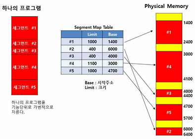
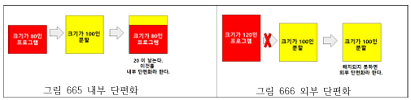

## 가상메모리 세그먼테이션 기법

가상메모리 세그먼테이션 기법

---

가상메모리 세그먼테이션 기법은 가상기억장치에 보관되어 있는 프로그램을 가장 합리적인 다양한 크기의 논리적인 단위로 나눈 후 주기억장치에 적재해서 실행시키는 기법이다.
블록 사이즈가 가변적인 방식으로서, 가변 사이즈 블록을 세그먼트(Segment)라 한다.
세그먼테이션 기법을 이용하는 가장 큰 이유는 내부 단편화를 줄여 기억 공간을 절약하기 위함이다.
고정된 분할의 경계를 없앰으로 작업에 필요한 만큼의 기억장치를 할당하여 내부 단편화는 발생하지 않으나, 외부 단편화가 발생할 수 있다.
외부 단편화를 해결하기 위해서는 압축을 해야 한다.
세그먼트는 각각 하나의 테이블로 보조기억장치에 저장되며, 주기억장치에 연속적으로 기억 공간에 적재된다.

 

##### 세그먼테이션 장점

세그먼테이션은 내부 단편화는 발생하지 않고 시스템이 실행 중인 작업에서 메모리를 제어가 가능하다.
세그먼트는 크기는 보조 측면에서 세그먼트 시스템은 페이지 시스템보다 수행 방법이 쉽고 효율적이다.

 

##### 세그먼테이션 단점

세그먼트의 크기가 고정되지 않아 가변적이여 외부 단편화가 발생할 수 있다. 
최초 적합, 최적 적합 등의 배치 기법이 필요하다.

