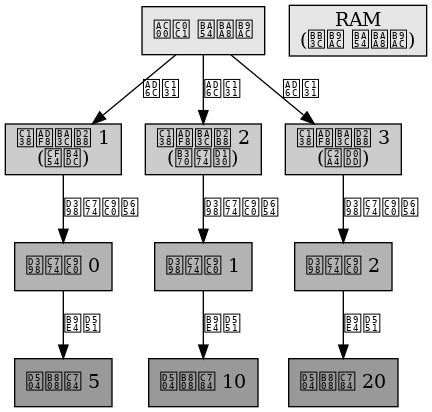

## 가상 메모리 페이지드 세그멘테이션 기법

가상 메모리 페이지드 세그멘테이션 기법

---

가상 메모리 페이지드 세그멘테이션 기법은  세그먼테이션 기법의 논리적 장점과 페이징 기법의 메모리 관리 측면의 장점을 활용한다.
프로그램을 논리적인 세그먼트 단위로 분할하고 분할된 각 세그먼트를 다시 각각의 페이지 단위로 분할하여 나누어 관리한다다.
세그먼트가 너무 가변적이고 때로는 그 크기가 지나치게 커서 주기억장치에 적재할 수 없는 경우의 문제점을 극복하기 위한 방법으로 외부 단편화가 발생한다.

 

가상 메모리 페이지드 세그멘테이션 기법은 가상 메모리를 효과적으로 관리하는 데 사용한다.