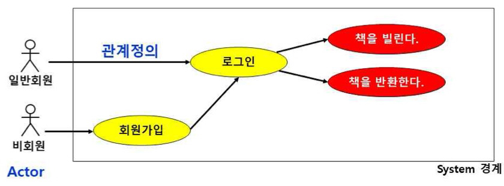
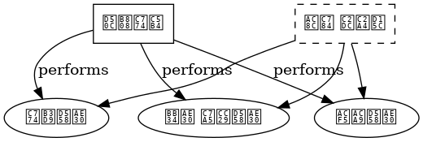

## 유즈케이스 다이어그램

유즈케이스 다이어그램

---

유즈케이스 다이어그램은 UML 다이어그램 중 행위 다이어그램으로 가장 중요한 모델 요소로 Use Case, Actor 간의 관계로 표현한다.
요구사항 분석부터 테스트까지 모든 개발과정을 이끌어 가는 모델 요소로, 시스템의 기능을 나타내기 위해 사용자의 요구를 추출하고 분석하는 데 사용한다.
액터와 유스케이스, 관계로 구성되어 있다.

언리얼 엔진에서는 플레이어의 행동을 분석하거나 무기 시스템을 구현할 때 사용이 가능하다. 플레이어의 시스템 중 이동하거나 공격하거나 무기를 장착하는 것을 구현할 수 있다.

 

##### 유스케이스 다이어그램 구성 요소
액터 : 시스템 외부에 존재하며 시스템과 상호작용을 하는 모든 것을 말한다. 대게 시스템을 사용하는 사용자와, 시스템을 사용함으로써써 상호작용되는 다른 시스템이 액터가 될 수 있다.
유스케이스 : 사용자의 입장에서 바라본 시스템의 추상적인 기능으로 시스템의 요구사항을 나타내며 타원형으로 표기한다.
연관 관계 : 액터와 유스케이스 간에 상호 작용이 존재하는지를 나타낸다.
포함 관계 : 유스케이스를 실행하기 위해 반드시 실행되어야 하는 유스케이스가 존재하는지 나타낸다.
확장 관계 : 유스케이스를 실행함으로써 선택적으로 실행되는 유스케이스가 존재하는지 나타낸다. 예를 들어 캐릭터를 선택한 후 해당 캐릭터의 스킬을 나타내는 기능을 만들 수 있다.
일반화 관계 : 액터 또는 유스케이스가 구체화 된 다른 액터 또는 유스케이스를 가지고 있는지를 나타낸다.

