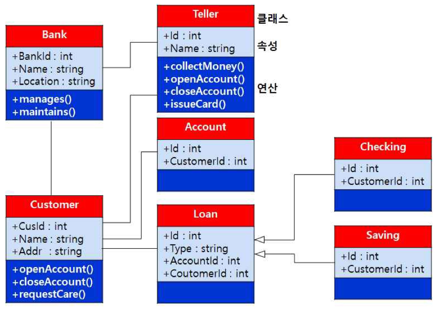
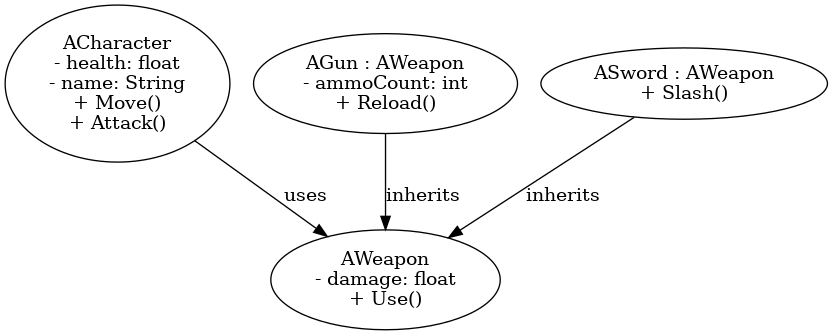

## 클래스 다이어그램

클래스 다이어그램

---

클래스 다이어그램은 UML 다이어그램 중 행위 다이어그램의 한 종류로 객체, 클래스, 속성, 오퍼레이션 및 연관관계를 이용하여 시스템을 나타낸다. 오퍼레이션은 클래스의 동작을 나타내며, 클래스에 속하는 객체에 적용될 메서드를 정의한다.
시스템 구조를 나타내며, 클래스 속성 및 클래스들의 관계를 이용하여 시스템을 나타낸다.
클래스들을 표현하고 그 클래스들의 정적인 관계를 표현한다.
클래스는 각 객체의 공통 요소를 추상화하고, 그것을 틀로 정의한 것이다.
한 클래스의 속성과 메서드를 표현한다.

 

언리얼 엔진에서는 캐릭터의 클래스를 설계하거나 게임 시스템을 설계하거나 상속 구조를 만들 때 유용하게 사용된다. 
예를 들어 캐릭터와 무기 시스템을 만든다고 할 때 캐릭터에는 체력과, 이름 변수가 필요하고 움직이는 Move 함수와 공격하는 Attack 함수가 필요하다. 무기 시스템은 기본적으로 무기의 데미지 양양을 가지는 기본 클래스와 그를 상속받아 추가적인 기능을 구현하는 함수를 만드는 데 사용된다.

 

클래스 다이어그램은 시스템의 정적인 구조를 시각적으로 표현해 주는 UML 다이어그램이다.
