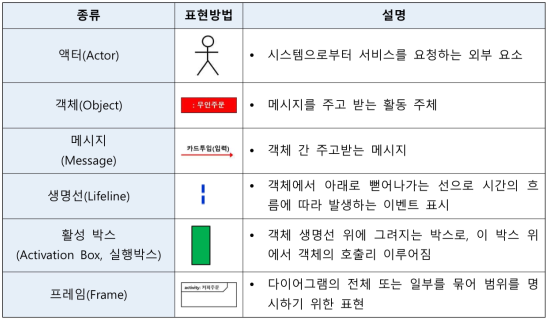
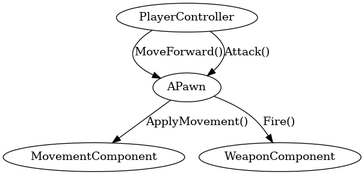

## 시퀀스 다이어그램

시퀀스 다이어그램

---

시퀀스 다이어그램은 UML 다이어그램 중 행위 다이어그램에 해당되는 것으로 객체들 간의 메시지 교환을 시각화하여 나타낸다. 객체들 사이에 일어나는 상호 작용을 나타낸다.
시스템의 동적구조, 객체와 객체 그룹 사이, 객체와 객체 사이, 객체  그룹과 객체 그룹 사이의 동적인 행위를 순서 흐름에 따라 기술하는 표현법으로 시간, 객체 메시지 등으로 구성된다.
액터들 간의 메시지 송, 수신을 표현한 다이어그램이다.

 

언리얼에서 시퀀스 다이어그램은 캐릭터가 입력을 받아 이동, 공격, 대기 등의 상태로 전환되는 흐름을 시각화한다. 또는 UI에서 버튼을 누르면 호출되는 이벤트와 UI의 업데이트를 처리하는 데 사용이 가능하다.

 

시퀀스 다이어그램은 객체 간 상호작용과 메시지 교환 흐름을 시간 순서에 따라 시각적으로 표현하는 다이어그램이다.