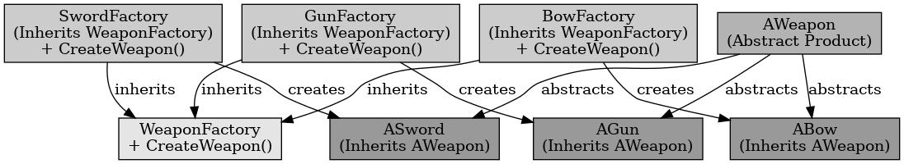

## 팩토리 메서드 패턴

팩토리 메서드 패턴

---

팩토리 메서드 패턴은 객체를 생성하기 위한 인터페이스를 정의하여 어떤 클래스가 인스턴스화될 것인지는 서브 클래스가 결정하도록 하는 것이다. 상위 클래스에서 객체를 생성하는 인터페이스를 정의하고, 하위 클래스에서 인스턴스를 생성하도록 하는 방식이다. 이는 다른 말로 Virtual Constructor 패턴이라고도 한다.

언리얼 엔진에서 팩토리 메서드는 객체 생성을 하는 과정에서 자주 사용된다.
예를 들어 다양한 무기를 생성하는 클래스를 팩토리 메서드 패턴으로 구현이 가능하다. 칼을 구현할 때 칼 클래스는 기본 무기 클래스를 부모로 가진다. 칼을 생성하는 생성자인 서브 클래스는 기본 무기 클래스를 생성하는 서브 클래스를 오버라이드 하여 정의한다. 이때 무기 생성 로직은 각 클래스에 캡슐화되어 있다.

 

팩토리 메서드 패턴은 객체 생성 로직을 캡슐화하여, 생성을 서브 클래스에서 처리하는 패턴이다.