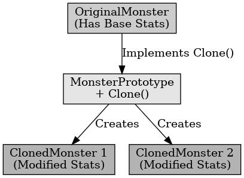

## 프로토타입 패턴

프로토타입 패턴

---

프로토타입 패턴은 디자인 패턴의 생성 패턴 중 하나로 프로토타입을 먼저 생성하고 인스턴스를 복제하여 사용하는 구조이다. 원본 객체를 복제하는 방법으로 객체를 생성한다.

언리얼 엔진에서 적이 있을 때 기존 몬스터 객체를 복제하여 새로운 몬스터를 생성할 수 있다. 이때 클론 몬스터는 기존 몬스터의 외형이나 능력치를 복제하여 생성한다. 하지만 클론 몬스터와 기존 몬스터는 독립적으로 움직이며, 서로 상태의 영향을 주지 않는다.

 

프로토타입 패턴은 기존 객체를 복제하여 새로운 객체를 생성하는 패턴이다.