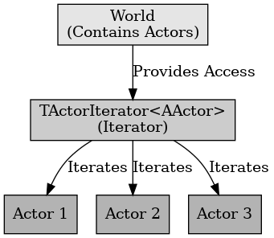

## ​이터레이터 패턴

​이터레이터 패턴

---

​이터레이터 패턴은 디자인 패턴의 행위 패턴 중 하나로 다른 말로 반복자 패턴이라고 한다. 이는 자료 구조와 같이 접근이 잦은 객체에 대해 동일한 인터페이스를 사용하도록 하는 패턴이다. 이터레이터 패턴을 사용하면 내부 구조를 노출하지 않고 접근이 가능하다.

언리얼 엔진에서 이터레이터 패턴의 예시로는 TActorIterator를 말할 수 있다. TActorIterator은 순회를 하여 레벨에 배치되어 있는 액터들을 찾을 수 있다. 이를 이용하면 원하는 타입의 액터도 쉽게 찾을 수 있다. TActorIterator를 이용하면 내부 구조를 노출하지 않고 액터들에게 접근이 가능하다.

 

이터레이터 패턴은 내부 요소에 순차적으로 접근하는 방법을 제공하는 패턴이다.