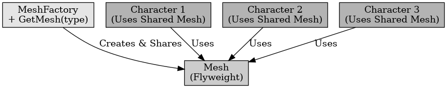

## 경량화 패턴

경량화 패턴

---

경량화 패턴은 디자인 패턴 중 구조 패턴에 해당되는 패턴으로 영어로 플라이 웨이트 패턴이라고 한다. 플라이 웨이트 패턴은 작은 개체들을 공유하여 메모리 사용량을 줄이고, 유사한 객체를 관리하는 패턴을 말한다. 동일하거나 유사한 객체가 반복적으로 사용되면 중복된 객체를 새로 생성하는 것이 아닌 기존 객체를 재사용한다.

언리얼 엔진에서 경량화 패턴은 매우 중요한 패턴이라고 볼 수 있다. 게임에 수백, 수천 마리의 적을 사용하는 경우 적을 하나씩 생성하면 메모리 사용량이 크다. 
이를 경량화 패턴을 이용하여 인스턴스로 생성을 하면 외형이나 애니메이션은 재사용이 가능하여 메모리 사용량을 줄여 줄 수 있다. 

 

적을 생성할 때뿐만 아니라 맵의 배경을 만든다고 할 때 풀이나 나무와 같은 객체들을 하나씩 생성하면 이 또한 많은 메모리를 사용할 것이다. 이도 경량화 패턴을 이용하면 메모리 사용량을 줄일 수 있다.

경량화 패턴은 비슷한 객체를 공유하여 메모리 사용량을 줄이는 패턴을 말한다. 내부 상태는 공유시키고 외부 상태는 따로 관리하여 개별적으로 수정이 가능하다.