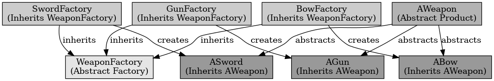

## 추상 팩토리 패턴

추상 팩토리 패턴

---

추상 팩토리 패턴은 디자인 패턴 중 생성 패턴에 해당되는 것으로 클래스에 의존하지 않고, 인터페이스를 통해 서로 의존적인 객체들의 조합을 만드는 인터페이스를 제공한다. 동일한 주제의 다른 팩토리를 묶어주는 패턴이다.

언리얼 엔진에서 클래스나 시스템, UI 등을 생성할 때 사용할 수 있다.
예를 들어 여러 종류의 무기를 사용하는 시스템을 만들 때 부모 클래스에 구현을 할 기능의 함수를 만들어두고 이를 자식 클래스에서 오버라이드 하여 더 구체적으로 구현이 가능하다. 이러한 패턴을 사용하면 무기마다 해당 기능을 다르게 사용이 가능하다.

 

추상 팩토리 패턴은 관련 객체들을 일관성 있게 생성하는 패턴이다.